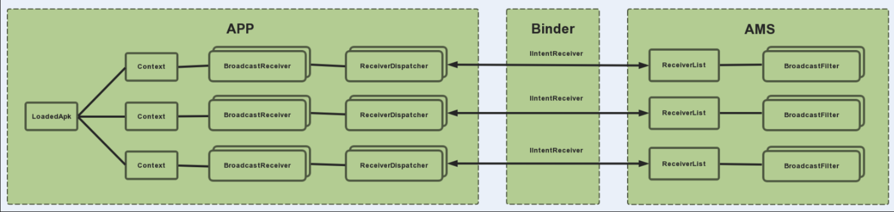

## Android 广播机制

### 概述

广播机制用于进程/线程间通信，广播分为广播发送和广播接收两个过程，其中广播接收者 BroadcastReceiver 就是 Android 四大组件之一

BrocadcastReceiver 注册方式分为两类：

- 静态注册：通过 AndroidManifest.xml 里的标签来注册明
- 动态注册：通过 registerReceiver()来注册

从发送方式分为三类：

- 普通广播：通过Context.sendBroadcast()发送，可并行处理
- 有序广播：通过Context.sendOrderedBroadcast()发送，串行处理
- Sticky广播：通过Context.sendStickyBroadcast()发送（已废弃）

广播在系统中以BroadcastRecord对象来记录, 该对象有几个时间相关的成员变量。

### 安全性

广播安全性问题

- 其他App可能会针对性的发出与当前App intent-filter相匹配的广播，由此导致当前App不断接收到广播并处理；

- 其他App可以注册与当前App一致的intent-filter用于接收广播，获取广播具体信息。

增加广播安全性的措施

- 对于同一App内部发送和接收广播，将exported属性人为设置成false，使得非本App内部发出的此广播不被接收；

- 在广播发送和接收时，都增加上相应的permission，用于权限验证；

- 发送广播时，指定特定广播接收器所在的包名，具体是通过intent.setPackage(packageName)指定，这样此广播将只会发送到此包中的App内与之相匹配的有效广播接收器中。

- 采用LocalBroadcastManager的方式

### Android 8.0

Android 8.0后，即当App targetSDK >= 26，几乎禁止了所有的**隐式广播**的静态注册监听。

除了有限的例外之外，应用无法使用清单注册（**静态注册**）的方式来接收**隐式广播**。

- 但对于这些隐式广播，可以通过运行时注册（**动态注册**）的方式注册。
- 对于**显式广播**，则依然可以通过清单注册（静态注册）的方式监听

### 原理

#### 动态注册过程源码分析

Activity是通过Context类的registerReceiver()方法进行动态注册广播监听的。Context是一个抽象类，它是应用端和AMS、WMS等系统服务进行通信的接口，Activity、Service和Application都是继承它的子类。Context的实现类是ContextImpl，也就是说注册时最终调用到的是ContextImpl中的registerReceiver方法。

ContextImpl中的registerReceiver方法最终会调用本类的私有方法registerReceiverInternal。在这个方法里面主要做了两件事情，一件是通过LoadedApk类提供的方法获得IIntentReceiver的实例，另一件是通过ActivityManagerService.registerReceiver方法把广播注册到AMS中。

```java
/**
 * Common implementation of Context API, which provides the base
 * context object for Activity and other application components.
 */
class ContextImpl extends Context {
    ...
    private Intent registerReceiverInternal(BroadcastReceiver receiver, int userId,
            IntentFilter filter, String broadcastPermission,
            Handler scheduler, Context context, int flags) {
        //1、通过LoadedApk类提供的方法获得IIntentReceiver的实例
        IIntentReceiver rd = null;
        if (receiver != null) {
            if (mPackageInfo != null && context != null) {
                if (scheduler == null) {
                    scheduler = mMainThread.getHandler();
                }
                rd = mPackageInfo.getReceiverDispatcher(
                    receiver, context, scheduler,
                    mMainThread.getInstrumentation(), true);
            } else {
                if (scheduler == null) {
                    scheduler = mMainThread.getHandler();
                }
                rd = new LoadedApk.ReceiverDispatcher(
                        receiver, context, scheduler, null, true).getIIntentReceiver();
            }
        }

        //2、通过ActivityManagerService.registerReceiver方法把广播注册到AMS中
        try {
            final Intent intent = ActivityManager.getService().registerReceiver(
                    mMainThread.getApplicationThread(), mBasePackageName, rd, filter,
                    broadcastPermission, userId, flags);
            if (intent != null) {
                intent.setExtrasClassLoader(getClassLoader());
                intent.prepareToEnterProcess();
            }
            return intent;
        } catch (RemoteException e) {
            throw e.rethrowFromSystemServer();
        }
    }
    ...
}
```

每一个应用都持有一个LoadedApk实例，LoadedApk实例中包含多个Context实例（一个进程对应多个Activity和Service以及一个Application）,每个Context实例可能创建了多个BroadcastReceiver实例，每个BroadcastReceiver实例在动态注册的时候都会生成一个对应的ReceiverDispatcher实例，每个ReceiverDispatcher实例内部又会由InnerReceiver类生成一个IIntentReceiver实例。这个IIntentReceiver实例在动态注册BroadcastReceiver的时候会被传递给AMS，AMS会为每个IIntentReceiver实例创建一个ReceiverList实例，每个ReceiverList实例中保存了多个BroadcastFilter实例，而这个BroadcastFilter实例里面包含了具体的IntentFilter和ReceiverList等相关信息。



#### 静态注册过程源码分析

BroadcastReceiver静态注册指的是在AndroidManifest.xml中声明的接收器，在系统启动的时候，会由PMS去解析。当AMS调用PMS的接口来查询广播注册的时候，PMS会查询记录并且返回给AMS。

#### 广播的发送和接收

以最简单普通广播为例，直接跳到Context的实现类ContextImpl的sendBroadcast方法。从源码看sendBroadcast里面基本没干什么事，直接去调用的AMS的broadcastIntent方法。

```java
    @Override
    public void sendBroadcast(Intent intent) {
        warnIfCallingFromSystemProcess();
        String resolvedType = intent.resolveTypeIfNeeded(getContentResolver());
        try {
            intent.prepareToLeaveProcess(this);
            // 1、调用的AMS的broadcastIntent方法发送广播
            ActivityManager.getService().broadcastIntent(
                    mMainThread.getApplicationThread(), intent, resolvedType, null,
                    Activity.RESULT_OK, null, null, null, AppOpsManager.OP_NONE, null, false, false,
                    getUserId());
        } catch (RemoteException e) {
            throw e.rethrowFromSystemServer();
        }
    }
```

应用端调用系统服务（AMS）发送广播，AMS会去广播解析器IntentResolver中查询哪些BroadcastFilter跟这个广播有关联，然后把相关信息封装成 BroadcastRecord类的实例添加到广播发送序列BroadcastQueue中逐个广播。在BroadcastQueue中广播的时候会从BroadcastRecord中获得BroadcastFilter进而获得对应的ReceiverList，ReceiverList中包含了对应的IIntentReceiver实例，通过这个IIntentReceiver实例就可以找到对应的BroadcastReceiver，调用其BroadcastReceiver.OnReceive方法把广播传递给对应的BroadcastReceiver。

#### 总结

通过上面的分析，我们深入了解了广播接收器BroadcastReceiver是如何完成动态注册的，以及广播是如何发送和被接收的。中间涉及到诸多个类的多个方法调来调去，看起来比较复杂，但是如果你看懂了之前BroadcastReceiver动态注册的关系图，理解起来就相对简单了。
广播接收器BroadcastReceiver的动态注册过程可以简单的理解为建立两个映射关系的过程：

- 建立LoadedApk、Context、BroadcastReceiver和ReceiverDispatcher的映射关系。
- 建立ReceiverList和BroadcastFilter的映射关系。

这两个映射关系共同持有同一个IIntentReceiver，IIntentReceiver是这两个映射关系中间的桥梁，客户端和服务端通过IIntentReceiver接口来完成进程间通信。

知道了上面的两个映射关系以及这两个映射关系之间的关联之处，广播的发送和接收就可以简单的理解为一个反向关系查找的过程。AMS根据Context广播的Intent信息对照映射关系表从BroadcastFilter开始，反向一层一层找到与之对应的BroadcastReceiver，最终完成BroadcastReceiver.OnReceive的调用，把Intent传递给对应的BroadcastReceiver。