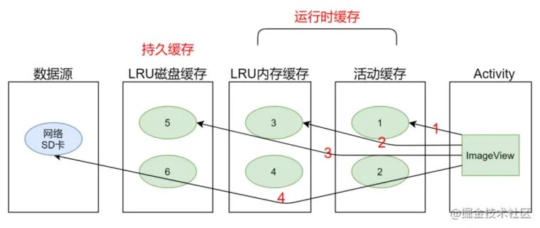
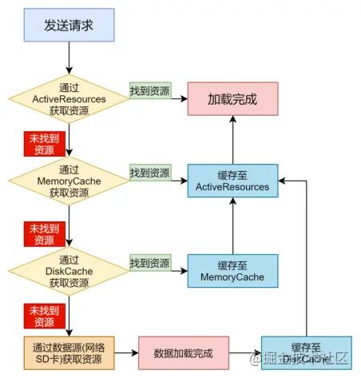

#### 单图片加载

- BitmapFactory

#### 多图片加载

使用内存缓存技术。内存缓存技术对那些大量占用应用程序宝贵内存的图片提供了快速访问的方法。其中最核心的类是LruCache (此类在android-support-v4的包中提供) 。这个类非常适合用来缓存图片，它的主要算法原理是把最近使用的对象用强引用存储在 LinkedHashMap 中，并且把最近最少使用的对象在缓存值达到预设定值之前从内存中移除。

## 开源库

### Glide

源码地址：https://github.com/bumptech/glide

核心用法：

```java
// 加载本地图片
File file = new File(getExternalCacheDir() + "/image.jpg");
Glide.with(this).load(file).into(imageView);

// 加载应用资源
int resource = R.drawable.image;
Glide.with(this).load(resource).into(imageView);

// 加载二进制流
byte[] image = getImageBytes();
Glide.with(this).load(image).into(imageView);

// 加载Uri对象
Uri imageUri = getImageUri();
Glide.with(this).load(imageUri).into(imageView);
```

其实就是关键的三步走：先with()，再load()，最后into()。

#### 缓存机制

默认情况下，Glide 会在开始一个新的图片请求之前检查以下多级的缓存：

- 活动资源 (Active Resources) - 现在是否有另一个 View 正在展示这张图片？
- 内存缓存 (Memory cache) - 该图片是否最近被加载过并仍存在于内存中？
- 资源类型（Resource） - 该图片是否之前曾被解码、转换并写入过磁盘缓存？
- 数据来源 (Data) - 构建这个图片的资源是否之前曾被写入过文件缓存？

前两步检查图片是否在内存中，如果是则直接返回图片。后两步则检查图片是否在磁盘上，以便快速但异步地返回图片。

如果四个步骤都未能找到图片，则Glide会返回到原始资源以取回数据（原始文件，Uri, Url等）。

Glide使用了ActiveResources（活动缓存**弱引用**）+MemoryCache（内存缓存**Lru算法**）+DiskCache(磁盘缓存**Lru算法**）。

- ActiveResources：存储当前界面使用到的图片。界面不展示后，该Bitmap又被缓存至MemoryCache中，并从ActiveResources中删除。
- Memory Cache：存储当前没有使用到的Bitmap，当MemoryCache中得到Bitmap后，该Bitmap又被缓存至ActiveResources中，并从MemoryCache中删除。
- Disk Cache：持久缓存。例如图片加圆角，处理后图片会被缓存到文件中，应用被再次打开时可以加载缓存直接使用。

**注意：** ActiveResources + MemoryCache是内存缓存，都属于**运行时缓存**，**且互斥**(同一张图片不会同时缓存在ActiveResources+MemoryCache)，应用被杀死后将不存在。

Glide 内部是使用 LruCache、弱引用和硬盘缓存实现的。 Glide 主要将缓存分为两块内存缓存和硬盘缓存，两种缓存的结合，构成了 Glide 缓存机制的核心。





#### LRU 是什么

LRU (Least Recently Used) 是近期最少使用的算法(缓存淘汰算法)，它的核心思想是当缓存满时，会优先淘汰那些近期最少使用的缓存对象。采用LRU算法的缓存有两种：**LruCache和DisLruCache**，分别用于实现**内存缓存和硬盘缓存**，其核心思想都是LRU缓存算法。

LruCache的核心思想很好理解，就是要维护一个缓存对象列表，其中对象列表的排列方式是按照访问顺序实现的，即一直没访问的对象，将放在队尾，即将被淘汰。而最近访问的对象将放在队头，最后被淘汰。

##### LruCache

存在一个LinkedHashMap存放数据，并且实现了LRU(最少使用算法)缓存策略。

```java
Map<T,Y> cache = new LinkedHashMap<>(100,0.75f, true):
```

利用了LinkedHashMap排序方式的特性：由于使用访问顺序排序，进行了get/put操作的元素会放在Map最后面。所以当最后一个元素插入进来时，如果当前的缓存数据大小超过了最大限制，那么会删除Map中放在前面的元素。


具体解析： 

[Android图片加载框架最全解析——Glide](http://blog.csdn.net/guolin_blog/article/details/53759439)

[Google推荐的图片加载库Glide介绍](http://www.jcodecraeer.com/a/anzhuokaifa/androidkaifa/2015/0327/2650.html)

#### Picasso

#### Fresco

#### UniversalImageLoader

#### 