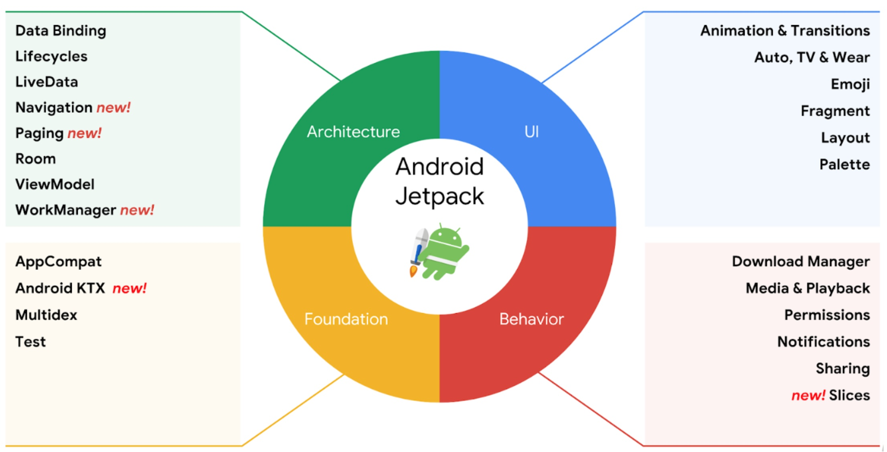

## Android JetPack

#### JetPack是什么

JetPack是Google推出的一些库的集合，是Android基础支持库SDK以外的部分。包含了组件、工具、架构方案等，开发者可以自主按需选择接入具体的哪个库。其最核心的出发点就是帮助开发者快速构建出稳定、高性能、测试友好同时向后兼容的APP。

#### 组成部分

从官方的介绍来看。JetPack总体包含四部分内容：

##### 基础（Foundation）

AppCompat ： 使得支持较低的Android版本。从以前继承Activity到现在继承AppCompatActivity 就是属于这一部分。

[Android KTX](https://link.zhihu.com/?target=https%3A//juejin.im/post/5a7fe05bf265da4e710f55e3) : Kotlin的扩展支持库

[Multidex](https://link.zhihu.com/?target=https%3A//developer.android.com/studio/build/multidex.html) : 多dex文件支持

[Test](https://link.zhihu.com/?target=https%3A//developer.android.com/topic/libraries/testing-support-library/index.html) : 测试支持库

##### 架构（Architecture）

[Data Binding](https://link.zhihu.com/?target=https%3A//juejin.im/post/5b02cf8c6fb9a07aa632146d) : MVVM的一种实践

[Lifecycles](https://link.zhihu.com/?target=https%3A//www.jianshu.com/p/b1208012b268) : 管理你的 Activity 和 Fragment 生命周期

[LiveData](https://link.zhihu.com/?target=https%3A//www.jianshu.com/p/550a8bd71214) : 通过观察者模式感知数据变化，类比RxJava

[Navigation](https://link.zhihu.com/?target=https%3A//blog.csdn.net/mq2553299/article/details/80445952) : 处理Fragment导航相关逻辑

[Paging](https://link.zhihu.com/?target=https%3A//www.jianshu.com/p/10bf4bf59122) : 分页数据加载方案

[Room](https://link.zhihu.com/?target=http%3A//www.jcodecraeer.com/a/anzhuokaifa/androidkaifa/2017/0726/8249.html) : 官方ORM库

[ViewModel](https://link.zhihu.com/?target=https%3A//www.jianshu.com/p/59adff59ed29) : 通过数据驱动V视图发生改变

[WorkManager](https://link.zhihu.com/?target=https%3A//juejin.im/entry/5b05a2315188254284526ac9) : 管理后台任务

##### 行为（Behavior）

[DownloadManager](https://link.zhihu.com/?target=https%3A//juejin.im/entry/58b69df2a22b9d005ec81a72) : 管理下载任务

[Media app](https://link.zhihu.com/?target=https%3A//developer.android.com/guide/topics/media-apps/media-apps-overview.html) ： 多媒体播放和一些向后兼容的API。主要包含MediaPalyer和ExoPlayer

[Notifications](https://link.zhihu.com/?target=https%3A//developer.android.com/guide/topics/ui/notifiers/notifications.html) : 提供向后兼容的通知 API，支持 Wear 和 Auto

[Permissions](https://link.zhihu.com/?target=https%3A//developer.android.com/guide/topics/permissions/overview) : 权限管理，这个应该都接触过。用于检查和请求应用权限

[Settings](https://link.zhihu.com/?target=https%3A//developer.android.com/guide/topics/ui/settings) : Preference相关API。基本每个应用都会用到

[Share Action](https://link.zhihu.com/?target=https%3A//developer.android.com/training/sharing/shareaction) : 提供分享操作。这块在国内使用的不多，都是自己封装或者采用第三方方案。

[Slices](https://link.zhihu.com/?target=https%3A//www.jianshu.com/p/a90563606e1f) : 可以让应用通过外部（其他APP）显示APP界面（通过设备自带的搜索，语音助手等）

##### 界面（UI）

[Animations and Transitions](https://link.zhihu.com/?target=https%3A//developer.android.com/training/animation/) : 动画，界面转场等

[Auto](https://link.zhihu.com/?target=https%3A//developer.android.com/auto) : 针对车辆的标准化界面和模式。这方面实在接触的少，不感妄加评论。

[Emoji](https://link.zhihu.com/?target=https%3A//developer.android.com/guide/topics/ui/look-and-feel/emoji-compat) : Emoji 相关。这个...同上面的Auto吧

[Fragment](https://link.zhihu.com/?target=https%3A//developer.android.com/guide/components/fragments) : 基础概念

[Layout](https://link.zhihu.com/?target=https%3A//developer.android.com/guide/topics/ui/declaring-layout) : 基础概念

[Palette-Colors](https://link.zhihu.com/?target=https%3A//developer.android.com/training/material/palette-colors) : 调色板。接触的不多

[TV](https://link.zhihu.com/?target=https%3A//developer.android.com/tv) : Android TV 开发相关

[Wear](https://link.zhihu.com/?target=https%3A//developer.android.com/wear) ： 可穿戴设备（目前主要是手表）开发相关

#### 如何看待 JetPack

**JetPack更多是一种概念和态度**。相当于Google把自己的Android生态重新整理了一番。确立了Android未来的版图和大方向。

JetPack里目前包含的内容，未来也会是Google大力维护和扩展的内容。对应开发者来说也是值得去学习使用的且相对无后顾之忧的。JetPack里没有的，除开一些优秀的第三方库，未来应该也会慢慢被新的API替代，逐渐边缘化，直至打上Deprecate注解。

以当下的环境来说，要开发出一个完全摆脱JetPack的APP是很难做到的。但是反过来讲JetPack也远远没有到成熟的地步，目前也还存在亟待解决的问题，未来可以做的事情还有很多。

关于使用的话，并不是所有库都建议使用，因为目前还有很多库在alpha版本。但是作为学习还是很有必要的，能给你日常的开发中多提供一些思路，这些是无可厚非的。

总的来说，JetPack的推广对广大开发者而言是利远远大于弊的。

https://juejin.im/post/5c4e9e8ce51d451bb73ad665

