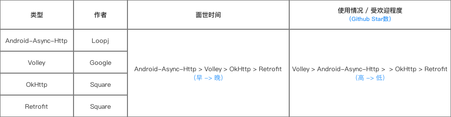
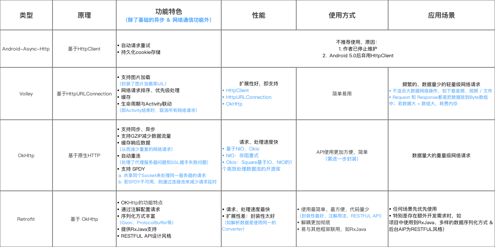

### Retrofit 详解

### 概述

Retrofit 是当下最热门的一个网络请求库。

github 地址：[retrofit](https://github.com/square/retrofit)

官方网站：https://square.github.io/retrofit/

准确的说，Retrofit 是一个 RESTful 的 Http 网络请求框架的封装。网络请求的工作本质上是 OkHttp 完成，而 Retrofit 仅负责网络请求接口的封装。

##### 为什么使用网络库？

实现网络请求的需求同时不需要考虑: 异步请求、线程池、缓存等。同时还可以：降低开发难度、缩短开发周期、使用方便

##### 常见网络请求开源库：

- [android-async-http](https://github.com/android-async-http/android-async-http)
- [volley](https://github.com/google/volley)
- [OkHttp](https://github.com/square/okhttp)
- [Retrofit](https://github.com/square/retrofit)



四大网络库的详细对比



### 使用说明

[这是一份很详细的 Retrofit 2.0 使用教程（含实例讲解）](http://blog.csdn.net/carson_ho/article/details/73732076)

### 源码分析

Retrofit 与一般网络请求是一样的过程，只是 Retrofit 使用大量的设计模式进行功能模块的解耦，使得上面的过程进行得更加简单流程。

具体过程解释如下：

1. 通过解析 网络请求接口的注解 配置 网络请求参数
2. 通过 动态代理 生成 网络请求对象
3. 通过 网络请求适配器 将 网络请求对象 进行平台适配
4. 通过 网络请求执行器 发送网络请求
5. 通过 数据转换器 解析服务器返回的数据
6. 通过 回调执行器 切换线程（子线程 ->>主线程）
7. 用户在主线程处理返回结果

Retrofit 使用步骤：

1. 创建 Retrofit 实例

   ```java
   Retrofit retrofit = new Retrofit.Builder()                                .baseUrl("http://fanyi.youdao.com/")                         .addConverterFactory(GsonConverterFactory.create())
                                    .build();
   ```

   Retrofit实例是**使用建造者模式通过Builder类**进行创建的。

2. 创建网络请求接口的实例

   ```java
   ApiService service = retrofit.create(ApiService.class);
   Call<JavaBean> call = service.getCall();
   ```

   Retrofit是**通过外观模式 & 代理模式 使用create（）方法**创建网络请求接口的实例（同时，通过网络请求接口里设置的注解进行了网络请求参数的配置）

3. 执行网络请求

   Retrofit 默认使用 OkHttp，即 OkHttpCall 类。

   OkHttpCall 提供了两种网络请求方式：

   同步请求：OkHttpCall.execute();

   异步请求：OkHttpCall.enqueue();