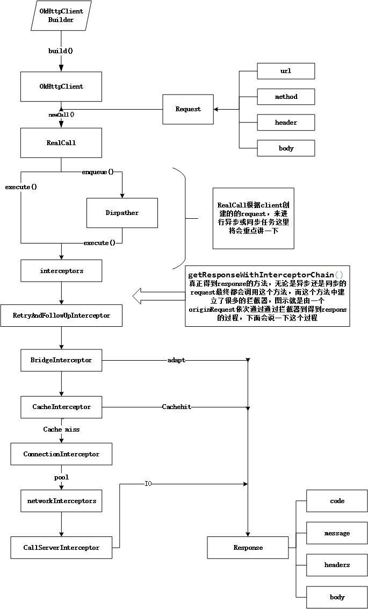
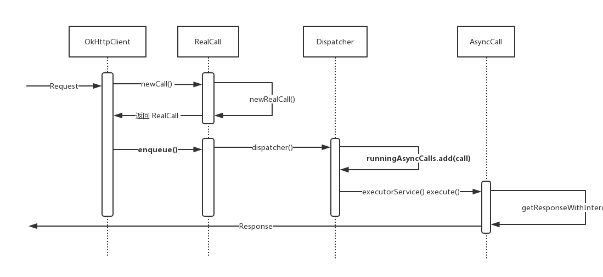

## OkHttp 深入理解

#### OkHttp 请求流程

OkHttp 请求流程如下所示：



如下为使用OkHttp进行Get请求的步骤：

```java
//1.新建OkHttpClient客户端
OkHttpClient client = new OkHttpClient();
//新建一个Request对象
Request request = new Request.Builder()
        .url(url)
        .build();
//2.Response为OKHttp中的响应
Response response = client.newCall(request).execute();
```

首先，我们会在请求的时候初始化一个Call的实例，然后**根据同步和异步的不同，分别调用它的 execute() 和 enqueue()** 方法，但是它们进行网络访问的逻辑都是一样的，内部最后都会执行到getResponseWithInterceptorChain()方法，这个方法里面通过拦截器组成的责任链，依次经过用户自定义普通拦截器、重试拦截器、桥接拦截器、缓存拦截器、连接拦截器和用户自定义网络拦截器以及访问服务器拦截器等拦截处理过程，来获取到一个响应并交给用户。



#### 分发器 Dispatcher

使用 OkHttp 的时候，我们会创建一个 RealCall 并将其加入到双端队列中。但是请注意这里的双端队列的名称是 runningSyncCalls，也就是说这种请求是同步请求，会在当前的线程中立即被执行。所以，下面的 getResponseWithInterceptorChain() 就是这个同步的执行过程。而当我们执行完毕的时候，又会调用 Dispatcher 的 finished(RealCall) 方法把该请求从队列中移除。所以，这种**同步的请求无法体现分发器的“分发”功能。**

除了同步的请求，还有异步类型的请求：当我们拿到了 RealCall 的时候，调用它的 enqueue(Callback responseCallback) 方法并设置一个回调即可。该方法会执行下面这行代码：

```java
client.dispatcher().enqueue(new AsyncCall(responseCallback));
```

当我们调用了 Dispatcher 的 enqueue(AsyncCall) 方法的时候也会将 AsyncCall 加入到一个队列中，并会在请求执行完毕的时候从该队列中移除，只是这里的队列是 **runningAsyncCalls 或者 readyAsyncCalls**。它们都是一个双端队列，并用来存储异步类型的请求。它们的
区别是，runningAsyncCalls 是正在执行的队列，当正在执行的队列达到了限制的时候，就会将其放置到就绪队列 readyAsyncCalls 中：

```java
synchronized void enqueue(AsyncCall call) {
    if (runningAsyncCalls.size() < maxRequests && runningCallsForHost(call) < maxRequestsPerHost) {
        runningAsyncCalls.add(call);
        executorService().execute(call);
    } else {
        readyAsyncCalls.add(call);
    }
}
```

当把该请求加入到了正在执行的队列之后，我们会立即使用一个线程池来执行该 AsyncCall。这样这个请求的责任链就会在一个线程池当中被异步地执行了。这里的线程池由 executorService() 方法返回：

```java
public synchronized ExecutorService executorService() {
    if (executorService == null) {
        executorService = new ThreadPoolExecutor(0, Integer.MAX_VALUE, 60, TimeUnit.SECONDS,
        new SynchronousQueue<Runnable>(), Util.threadFactory("OkHttp Dispatcher", false));
    }
    return executorService;
}
```

显然，当线程池不存在的时候会去创建一个线程池。除了上面的这种方式，我们还可以在构建 OkHttpClient 的时候，自定义一个 Dispacher，并在其构造方法中为其指定一个线程池。

#### 拦截器 Interceptors

1. 在配置 OkHttpClient时设置的interceptors；[eg. 最常用的:日志拦截器]

2. 负责失败重试以及重定向的 RetryAndFollowUpInterceptor；会根据服务器返回的信息判断这个请求是否可以重定向，或者是否有必要进行重试

3. 桥拦截器 BridgeInterceptor 用于从用户的请求中构建网络请求，然后使用该请求访问网络，最后从网络响应当中构建用户响应。[简单的说: 只是用来对请求进行包装，并将服务器响应转换成用户友好的响应]

4. 负责读取缓存直接返回、更新缓存的 CacheInterceptor

5. 负责和服务器建立连接的ConnectInterceptor；这里并没有真正地从网络中获取数据，而仅仅是打开一个连接。在获取连接对象的时候，使用了连接池 ConnectionPool 来复用连接。

   这里的**HttpCodec 用来编码请求并解码响应，RealConnection 用来向服务器发起连接**。它们会在下一个拦截器中被用来从服务器中获取响应信息。

   **StreamAllocation相当于一个管理类，维护了服务器连接、并发流和请求之间的关系，该类还会初始化一个 Socket 连接对象，获取输入/输出流对象**。当我们调用 streamAllocation 的 newStream() 方法的时候，最终会经过一系列的判断到达 StreamAllocation 中的 findConnection() 方法。该方法会被放置在一个循环当中被不停地调用以得到一个可用的连接。它优先使用当前已经存在的连接，不然就使用连接池中存在的连接，再不行的话，就创建一个新的连接。我们使用**连接复用**的一个好处就是省去了进行 TCP 和 TLS 握手的一个过程。因为建立连接本身也是需要消耗一些时间的，连接被复用之后可以提升我们网络访问的效率。

```java
public final class ConnectInterceptor implements Interceptor {

    @Override public Response intercept(Chain chain) throws IOException {
        RealInterceptorChain realChain = (RealInterceptorChain) chain;
        Request request = realChain.request();
        StreamAllocation streamAllocation = realChain.streamAllocation();

        boolean doExtensiveHealthChecks = !request.method().equals("GET");
        HttpCodec httpCodec = streamAllocation.newStream(client, chain, doExtensiveHealthChecks);
        RealConnection connection = streamAllocation.connection();

        return realChain.proceed(request, streamAllocation, httpCodec, connection);
    }
}
```

6. 配置 OkHttpClient 时设置的 networkInterceptors；[for web socket,自行了解]

7. 服务器请求拦截器 CallServerInterceptor 用来向服务器发起请求并获取数据。

   **位置决定了功能，最后一个 Interceptor 一定是负责和服务器实际通讯的，重定向、缓存等一定是在实际通讯之前的**

源码如下：

```java
Response getResponseWithInterceptorChain() throws IOException {
    // Build a full stack of interceptors.
    List<Interceptor> interceptors = new ArrayList<>();
    interceptors.addAll(client.interceptors());
    interceptors.add(retryAndFollowUpInterceptor);
    interceptors.add(new BridgeInterceptor(client.cookieJar()));
    interceptors.add(new CacheInterceptor(client.internalCache()));
    interceptors.add(new ConnectInterceptor(client));
    if (!forWebSocket) {
        interceptors.addAll(client.networkInterceptors());
    }
    interceptors.add(new CallServerInterceptor(forWebSocket));

    Interceptor.Chain chain = new RealInterceptorChain(interceptors, null, null, null, 0,
            originalRequest, this, eventListener, client.connectTimeoutMillis(),
            client.readTimeoutMillis(), client.writeTimeoutMillis());

    return chain.proceed(originalRequest);
}

```

这里，我们创建了一个列表对象之后把 client 中的拦截器、重连拦截器、桥拦截器、缓存拦截器、网络连接拦截器和服务器请求拦截器等依次加入到列表中。然后，我们用这个列表创建了一个拦截器链。这里使用了责任链设计模式，每当一个拦截器执行完毕之后会调用下一个拦截器或者不调用并返回结果。显然，我们最终拿到的响应就是这个链条执行之后返回的结果。当我们自定义一个拦截器的时候，也会被加入到这个拦截器链条里。

#### 连接管理 ConnectionPool

与请求的缓存类似，OkHttp 的连接池也使用一个双端队列来缓存已经创建的连接：

```java
private final Deque<RealConnection> connections = new ArrayDeque<>();
```

OkHttp 的缓存管理分成两个步骤，**一边当我们创建了一个新的连接的时候，我们要把它放进缓存里面；另一边，我们还要来对缓存进行清理**。在 ConnectionPool 中，当我们向连接池中缓存一个连接的时候，只要调用双端队列的 add() 方法，将其加入到双端队列即可，而清理连接缓存的操作则交给线程池来定时执行。

在 ConnectionPool 中存在一个静态的线程池：

```java
private static final Executor executor = new ThreadPoolExecutor(0 /* corePoolSize */,
    Integer.MAX_VALUE /* maximumPoolSize */, 
    60L /* keepAliveTime */,
    TimeUnit.SECONDS,
    new SynchronousQueue<Runnable>(), 
    Util.threadFactory("OkHttp ConnectionPool", true));

```

每当我们向连接池中插入一个连接的时候就会调用下面的方法，将连接插入到双端队列的同时，会调用上面的线程池来执行清理缓存的任务：

```java
void put(RealConnection connection) {
    assert (Thread.holdsLock(this));
    if (!cleanupRunning) {
        cleanupRunning = true;
        // 使用线程池执行清理任务
        executor.execute(cleanupRunnable);
    }
    // 将新建的连接插入到双端队列中
    connections.add(connection);
}
```

这里的清理任务是 cleanupRunnable，是一个 Runnable 类型的实例。它会在方法内部调用 cleanup() 方法来清理无效的连接。

在从缓存的连接中取出连接来判断是否应该将其释放的时候使用到了两个变量 maxIdleConnections 和 keepAliveDurationNs，分别表示最大允许的闲置的连接的数量和连接允许存活的最长的时间。默认空闲连接最大数目为5个，keepalive 时间最长为5分钟。该方法会对缓存中的连接进行遍历，以寻找一个闲置时间最长的连接，然后根据该连接的闲置时长和最大允许的连接数量等参数来决定是否应该清理该连接。
