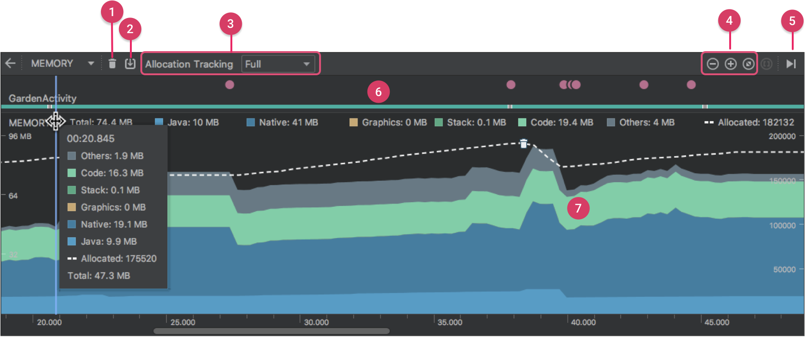
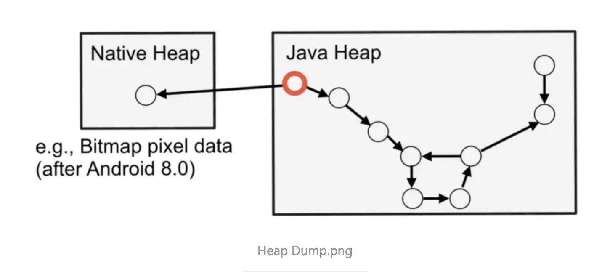
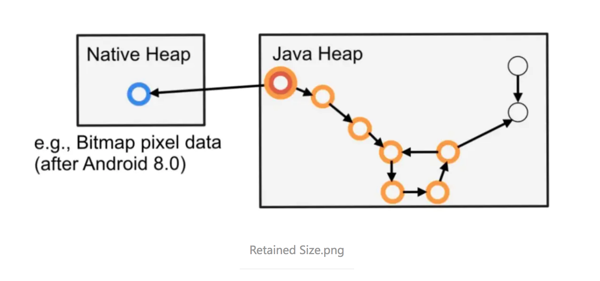

## Android 内存分析

### 内存分析工具

#### 1. Android Profiler - Memory

使用 Android Studio 中自带的 Profiler 内存分析器分析应用各部分所占内存情况。

内存计数中的类别如下：

- **Java**：从 Java 或 Kotlin 代码分配的对象的内存。

- **Native**：从 C 或 C++ 代码分配的对象的内存。

  即使您的应用中不使用 C++，您也可能会看到此处使用了一些原生内存，因为即使您编写的代码采用 Java 或 Kotlin 语言，Android 框架仍使用原生内存代表您处理各种任务，如处理图像资源和其他图形。

- **Graphics**：图形缓冲区队列为向屏幕显示像素（包括 GL 表面、GL 纹理等等）所使用的内存。（请注意，这是与 CPU 共享的内存，不是 GPU 专用内存。）

- **Stack**：您的应用中的原生堆栈和 Java 堆栈使用的内存。这通常与您的应用运行多少线程有关。

- **Code**：您的应用用于处理代码和资源（如 dex 字节码、经过优化或编译的 dex 代码、.so 库和字体）的内存。

- **Others**：您的应用使用的系统不确定如何分类的内存。

- **Allocated**：您的应用分配的 Java/Kotlin 对象数。此数字没有计入 C 或 C++ 中分配的对象。

##### 名词解释

- Allocations

  标识某个类的实例数量

- Native Size / Shallow Size / Retained Size

  Native Size，Shallow Size，Retained Size这几组数据分别意味着什么呢？通过一个例子来说明。

  我们用下图来表示某段 Heap Dump 记录的应用内存状态。注意红色的节点，在这个示例中，这个节点所代表的对象从我们的工程中引用了 Native 对象:

  在 Android 8.0 之后，使用 Bitmap 便可能产生此类情景，因为 Bitmap 会把像素信息存储在原生内存中来减少 JVM 的内存压力。

  **Shallow Size**：这列数据其实非常简单，就是对象本身消耗的内存大小，在上图中，即为红色节点自身所占内存（以字节为单位）。

  **Native Size**：同样也很简单，它是类对象所引用的 Native 对象 (蓝色节点) 所消耗的内存大小（以字节为单位）。

  **Retained Size**：稍复杂些，它是下图中所有橙色节点的大小（以字节为单位）。

  

  由于一旦删除红色节点，其余的橙色节点都将无法被访问，这时候它们就会被 GC 回收掉。从这个角度上讲，它们是被红色节点所持有的，因此被命名为 "Retained Size"。

  **Depth**：从 GC Roots 到达这个实例的最短路径。一个对象离 GC Roots 越近，它就越有可能与 GC Roots 有多条路径相连，也就越可能在垃圾回收中被保存下来。如果某个实例的 Depth 为 1，这意味着它直接被 GC Roots 引用，同时意味着它永远不会被回收。

  ### App 内存

  Android 给每个 app 分配了一个虚拟机（具体指的是 ART 虚拟机），让 app 运行在 Dalvik/ART 上，这样即使 app 崩溃也不会影响到系统。系统给虚拟机分配了一定的内存大小，app 可以申请使用的内存大小不能超过此硬性逻辑限制，就算物理内存富余，如果 app 超过虚拟机最大内存，就会出现 OOM。

  由程序控制操作的内存空间在 heap （堆）上，分 Java heapsize 和 native heapsize：

  - Java 申请的内存在虚拟机的 heap，所以如果 Java 申请的内存大小超过虚拟机的逻辑内存限制，就会出现 OOM

  - native 层内存申请不受其限制，native 层受 native process 对内存大小的限制。

  ### 内存问题

  在 Android 中主要解决的内存问题有三类：

  - 内存抖动

    频繁创建销毁对象触发 GC 导致内存不稳定，通常伴随着 app 卡顿（GC 会引发 STW（stop the world））。在 memory profiler 中体现为运行内存图形呈现锯齿状。

  - 内存泄漏

    本质是长生命周期对象持有短生命周期对象的引用，短生命周期对象在该回收的时候由于被引用而无法释放内存，这就导致了内存泄漏。

    如果 app 频繁卡顿时通常也伴随着可能存在内存泄漏。

    因为内存泄漏导致可用内存变少，系统在申请内存时因为内存不足而会频繁 GC 产生内存抖动

  - 内存溢出

    长期的内存泄漏和创建大对象无法分配足够的内存时就会触发 OOM

  #### 内存抖动

  内存抖动比较常见的地方：

  - 自定义 view 的 onMeasure()/onLayout()/onDraw() 里直接创建对象
  - RecyclerView 的 onBindViewHolder() 里直接创建对象
  - 有循环的代码中创建对象

  