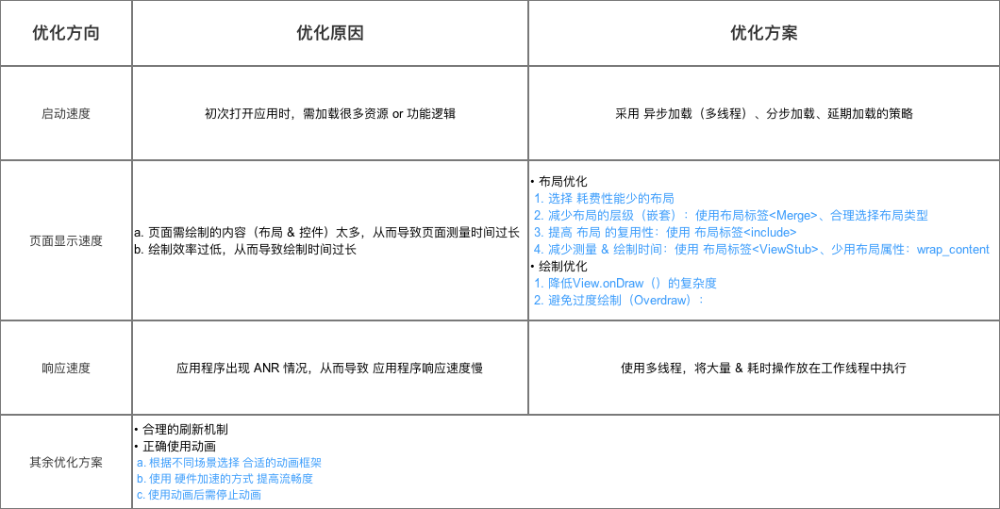
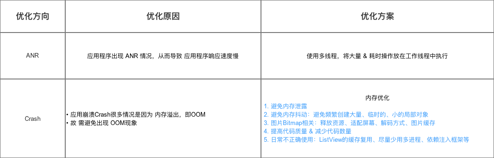
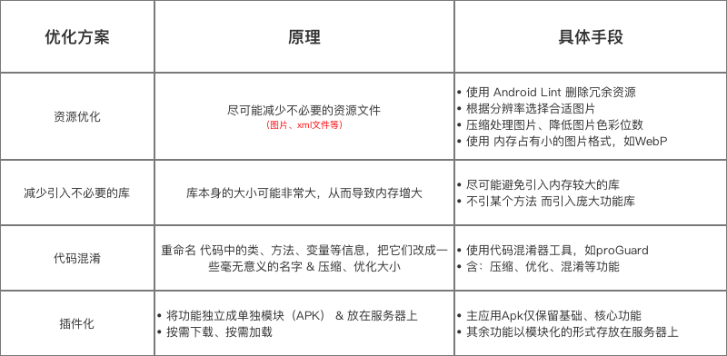
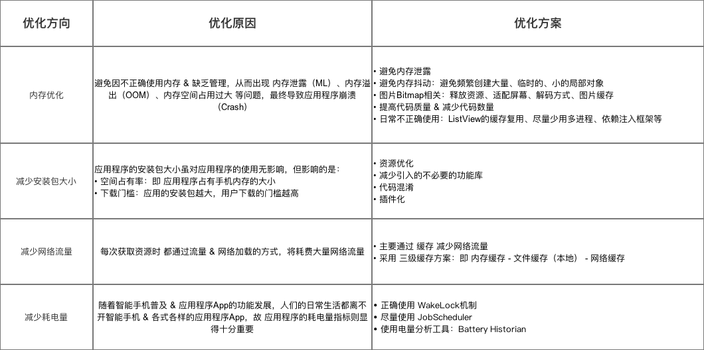
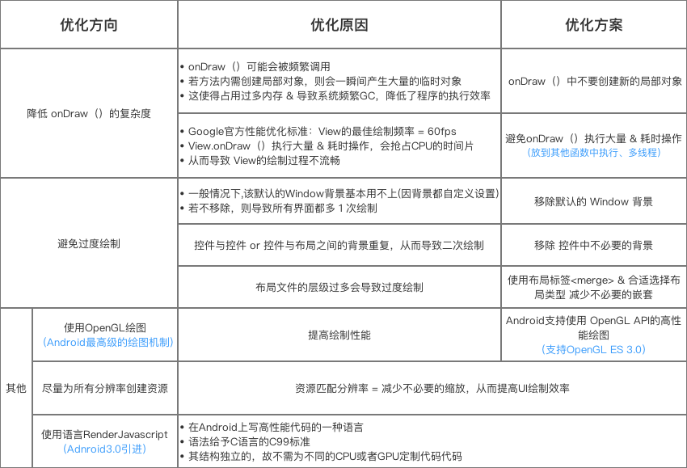

## Android 性能优化

### 流畅性



### 稳定性



### 资源节省性

减少安装包大小





#### 内存优化

- 节制地使用 Service

如果应用程序当中需要使用Service来执行后台任务的话，请一定要注意只有当任务正在执行的时候才应该让Service运行起来。另外，当任务执行完之后去停止Service的时候，要小心Service停止失败导致内存泄漏的情况。

为了能够控制Service的生命周期，Android官方推荐的最佳解决方案就是使用IntentService，这种Service的最大特点就是当后台任务执行结束后会自动停止，从而极大程度上避免了Service内存泄漏的可能性。

- 当界面不可见时释放内存

只需要在Activity中重写onTrimMemory()方法，然后在这个方法中监听TRIM_MEMORY_UI_HIDDEN这个级别，一旦触发了之后就说明用户已经离开了我们的程序，那么此时就可以进行资源释放操作了。

onTrimMemory()方法中的TRIM_MEMORY_UI_HIDDEN回调只有当我们程序中的所有UI组件全部不可见的时候才会触发，这和onStop()方法还是有很大区别的。

- 当内存紧张时释放内存

除了刚才讲的TRIM_MEMORY_UI_HIDDEN这个回调，onTrimMemory()方法还有很多种其它类型的回调，可以在手机内存降低的时候及时通知我们。我们应该根据回调中传入的级别来去决定如何释放应用程序的资源。

- 避免在Bitmap上浪费内存

当我们读取一个Bitmap图片的时候，有一点一定要注意，就是千万不要去加载不需要的分辨率。在一个很小的ImageView上显示一张高分辨率的图片不会带来任何视觉上的好处，但却会占用我们相当多宝贵的内存。占用内存=像素数*单个像素的字节数。

- 使用优化过的数据集合

Android API当中提供了一些优化过后的数据集合工具类，如SparseArray等，较传统 Java 中的 HashMap更为高效。关于区别，[请看这里](https://www.jianshu.com/p/aff3b8990ab3) 和 [请看这里](http://blog.csdn.net/u010687392/article/details/47809295)

- 知晓内存的开支情况

我们还应当清楚我们所使用语言的内存开支和消耗情况，并且在整个软件的设计和开发当中都应该将这些信息考虑在内。

- 谨慎使用抽象编程
- 尽量避免使用依赖注入框架
- 使用ProGuard简化代码
- 使用多个进程

如果你要使用它的话一定要谨慎使用，因为绝大多数的应用程序都不应该在多个进程当中运行的，一旦使用不当，它甚至会增加额外的内存而不是帮我们节省内存。这个技巧比较适用于那些需要在后台去完成一项独立的任务，和前台的功能是可以完全区分开的场景。

#### 内存泄露

Android Debug Monitor —> DDMS —> HProf file

内存分析工具 — MAT:

- ** Histogram**可以列出内存中每个对象的名字、数量以及大小。


- **Dominator Tree**会将所有内存中的对象按大小进行排序，并且我们可以分析对象之间的引用结构。

#### 绘制优化



#### 工具汇总

- Profile GPU Rendering

  卡顿检测工具。
  
  在开发者模式下打开，它是一个监测工具，能实时显示当前界面绘制的耗时。这个工具提供我们肉眼看一个页面的绘制情况的直观表现，一般并不会帮我们找到代码中哪些不合理的地方，需要其它工具才可以。
  
- TraceView

  性能检测分析工具。

  它可以检测Android应用层和Framework层的代码执行情况，形成一个图表，从中可以分析出每个方法的执行时间。

- Systrace

  性能数据采样和分析工具。

  它可以帮助开发者收集Android关键子系统（如surfaceflinger、WindowManagerService等Framework部分关键模块、服务，View系统等）的运行信息，从而帮助开发者更直观地分析系统瓶颈，改进性能。

  ##### Systrace 与 TraceView 比较：

  TraceView 试图收集某个阶段所有函数的运行信息。但可惜的是，**收集所有信息** 这个是不现实的，它的运行时开销严重干扰了运行环境。Systrace的思路是反过来的，在不清楚问题的情况下，你压根儿无法下手，只有掌握了一些基本的信息，通过假设－分析－验证 的过程一步一步找出问题的原因。

  TraceView 在易用性上占优，但是运行开销太大。Systrace 在易用性上较差，但是运行开销较小。

  ##### 使用方法：

  手机上App上的环境准备好以后，打开PC端的命令行；进入systrace的目录，也即(假设$ANDROID_HOME是你Android SDK的根目录）：

  > cd $ANDROID_HOME/platform-tools/systrace

  然后执行如下命令：

  > ./systrace.py -t 10 sched gfx view wm am app webview -a <package-name>

  这样，`systrace.py` 这个脚本就通过adb给手机发送了收集trace的通知；与此同时，切换到手机上进行你需要分析的操作，手动缩小范围，会帮助你加速收敛问题的分析过程，进而快速地定位和解决问题。

  `systrace.py`命令的一般用法是：

  > systrace.py [options] [category1 [category2 ...]]

  其中，`[options]` 是一些命令参数，`[category]` 等是你感兴趣的系统模块。

  `[option]` 中比较重要的几个参数如下：

  - **-a **：这个选项可以开启指定包名App中自定义Trace Label的Trace功能。也就是说，如果你在代码中使用了`Trace.beginSection("tag")`, `Trace.endSection`；默认情况下，你的这些代码是不会生效的，因此，这个选项一定要开启！
  - **-t N**：用来指定Trace运行的时间，取决于你需要分析过程的时间；还是那句话，在需要的时候尽可能缩小时间；当然，绝对不要把时间设的太短导致你操作没完Trace就跑完了，这样会出现`Did not finish` 的标签，分析数据就基本无效了。
  - **-l**：这个用来列出你分析的那个手机系统支持的Trace模块；也就是上面命令中 `[category1]`能使用的部分；不同版本的系统能支持的模块是不同的，一般来说，高版本的支持的模块更多。
  - **-o FILE**：指定trace数据文件的输出路径，如果不指定就是当前目录的`trace.html`。

  `systrace.py -l` 可以输出手机能支持的Trace模块，而且输出还给出了此模块的用途，常用的模块如下：

  - `sched`: CPU调度的信息，非常重要；你能看到CPU在每个时间段在运行什么线程；线程调度情况，比如锁信息。
  - `gfx`：Graphic系统的相关信息，包括SerfaceFlinger，VSYNC消息，Texture，RenderThread等；分析卡顿非常依赖这个。
  - `view`: View绘制系统的相关信息，比如onMeasure，onLayout等；对分析卡顿比较有帮助。
  - `am`：ActivityManager调用的相关信息；用来分析Activity的启动过程比较有效。
  - `dalvik`: 虚拟机相关信息，比如GC停顿等。
  - `binder_driver`: Binder驱动的相关信息，如果你怀疑是Binder IPC的问题，不妨打开这个。
  - `core_services`: SystemServer中系统核心Service的相关信息，分析特定问题用。

  Systrace没有办法在代码中控制Trace运行的开始和结束，那么我们如何要知道哪个时间段是我们需要的呢？可以用自定义Trace Label 解决，比如：

  ```java
  public View onCreateView(LayoutInflater inflater, @Nullable ViewGroup container,
              Bundle savedInstanceState) {
      Trace.beginSection("Fragement_onCreateView");
      // .. 其他代码
      // ...
      // .. 结束处
      Trace.endSection();
  }
  ```

  Systrace命令的使用不难，分析思路也很简单：合理假设-> 加自定义Label验证 -> (结论成立-> 缩小范围继续)／(结论推翻-> 重新假设) 这样一步一步直至问题收敛；如果你分析了一段时间，发现问题是发散的，一会儿觉得是这里有问题，一会儿又觉得是那里有问题，那么或许你的假设根本就是错误的；需要重新调整方向分析。

  [Systrace 基础知识](https://www.androidperformance.com/2019/05/28/Android-Systrace-About/)

  

