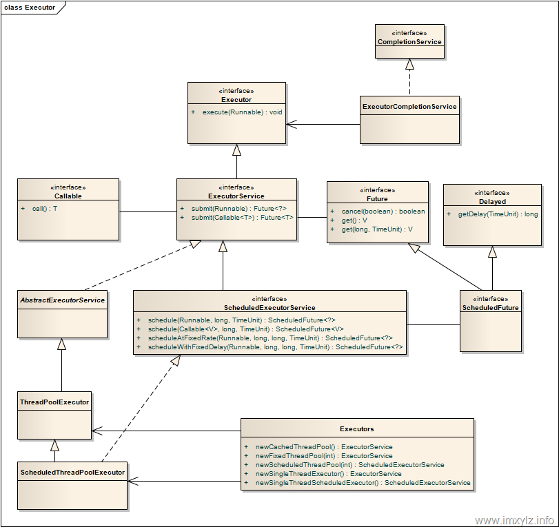

## Android Thread

### 线程池

#### 为什么使用线程池

1. 通过线程池中线程的重用，减少创建和销毁线程的开销
2. 控制线程池中的并发数，防止因为大量的线程争夺 CPU 资源造成阻塞
3. 线程池能够对线程进行管理，比如设置延迟任务/循环任务等

#### ThreadPoolExecutor



Executor 接口，Executor 并不是一个线程池，而只是一个执行线程的工具。

```java
public interface Executor {

    /**
     * Executes the given command at some time in the future.  The command
     * may execute in a new thread, in a pooled thread, or in the calling
     * thread, at the discretion of the {@code Executor} implementation.
     *
     * @param command the runnable task
     * @throws RejectedExecutionException if this task cannot be
     * accepted for execution
     * @throws NullPointerException if command is null
     */
    void execute(Runnable command);
}
```

ExecutorService 接口，**真正的线程池接口**

```java
public interface ExecutorService extends Executor {
    void shutdown();
    boolean isShutdown();
    <T> Future<T> submit(Callable<T> task);
    <T> Future<T> submit(Runnable task, T result);
    Future<?> submit(Runnable task);
    <T> List<Future<T>> invokeAll(Collection<? extends Callable<T>> tasks)
        throws InterruptedException;
    // ...
}
```

ThreadPoolExecutor 具体实现类

```java
public class ThreadPoolExecutor extends AbstractExecutorService {
	//核心线程数，除非allowCoreThreadTimeOut被设置为true，否则它闲着也不会死
	int corePoolSize, 
	//最大线程数，活动线程数量超过它，后续任务就会排队                   
	int maximumPoolSize, 
	//超时时长，作用于非核心线程（allowCoreThreadTimeOut被设置为true时也会同时作用于核心线程），闲置超时便被回收           
	long keepAliveTime,                          
	//枚举类型，设置keepAliveTime的单位，有TimeUnit.MILLISECONDS（ms）、TimeUnit. SECONDS（s）等
	TimeUnit unit,
	//缓冲任务队列，线程池的execute方法会将Runnable对象存储起来
	BlockingQueue<Runnable> workQueue,
	//线程工厂接口，只有一个new Thread(Runnable r)方法，可为线程池创建新线程
	ThreadFactory threadFactory
        
    public ThreadPoolExecutor(int corePoolSize,
                              int maximumPoolSize,
                              long keepAliveTime,
                              TimeUnit unit,
                              BlockingQueue<Runnable> workQueue,
                              ThreadFactory threadFactory,
                              RejectedExecutionHandler handler) {
        if (corePoolSize < 0 ||
            maximumPoolSize <= 0 ||
            maximumPoolSize < corePoolSize ||
            keepAliveTime < 0)
            throw new IllegalArgumentException();
        if (workQueue == null || threadFactory == null || handler == null)
            throw new NullPointerException();
        this.corePoolSize = corePoolSize;
        this.maximumPoolSize = maximumPoolSize;
        this.workQueue = workQueue;
        this.keepAliveTime = unit.toNanos(keepAliveTime);
        this.threadFactory = threadFactory;
        this.handler = handler;
    }
}
```

线程池中线程的创建过程：

1. 如果当前线程池的线程数还没有达到基本大小(poolSize < corePoolSize)，**无论是否有空闲的线程新增一个线程处理新提交的任务；**

2. 如果当前线程池的线程数大于或等于基本大小(poolSize >= corePoolSize) **且任务队列未满时**，就将新提交的任务提交到阻塞队列排队，等候处理workQueue.offer(command)；

3. 如果当前线程池的线程数大于或等于基本大小(poolSize >= corePoolSize) **且任务队列满时**；
   - 当前poolSize<maximumPoolSize，那么就**新增线程**来处理任务；
   - 当前poolSize=maximumPoolSize，那么意味着线程池的处理能力已经达到了极限，此时需要拒绝新增加的任务。至于如何拒绝处理新增的任务，取决于线程池的饱和策略RejectedExecutionHandler。

#### 常用的线程池

要配置一个线程池是比较复杂的，尤其是对于线程池的原理不是很清楚的情况下，很有可能配置的线程池不是较优的，

因此在 Executors 类里面提供了一些静态工厂，生成一些常用的线程池。

Executors 中具体实现

```java
public class Executors {
    
    //创建一个单线程的线程池。
    //这个线程池只有一个线程在工作，也就是相当于单线程串行执行所有任务。
    //如果这个唯一的线程因为异常结束，那么会有一个新的线程来替代它。此线程池保证所有任务的执行顺序按照任务的提交顺序执行。
    public static ExecutorService newSingleThreadExecutor() {
        return new FinalizableDelegatedExecutorService
            (new ThreadPoolExecutor(1, 1,
                                    0L, TimeUnit.MILLISECONDS,
                                    new LinkedBlockingQueue<Runnable>()));
    }
    
    //创建固定大小的线程池。
    //每次提交一个任务就创建一个线程，直到线程达到线程池的最大大小。
	//线程池的大小一旦达到最大值就会保持不变，如果某个线程因为执行异常而结束，那么线程池会补充一个新线程。
    public static ExecutorService newFixedThreadPool(int nThreads) {
        return new ThreadPoolExecutor(nThreads, nThreads,
                                      0L, TimeUnit.MILLISECONDS,
                                      new LinkedBlockingQueue<Runnable>());
    }	

    //创建一个可缓存的线程池。
    //如果线程池的大小超过了处理任务所需要的线程，那么就会回收部分空闲（60秒不执行任务）的线程，
	//当任务数增加时，此线程池又可以智能的添加新线程来处理任务。
	//此线程池不会对线程池大小做限制，线程池大小完全依赖于操作系统（或者说JVM）能够创建的最大线程大小。
    public static ExecutorService newCachedThreadPool() {
        return new ThreadPoolExecutor(0, Integer.MAX_VALUE,
                                      60L, TimeUnit.SECONDS,
                                      new SynchronousQueue<Runnable>());
    }
    
    //创建一个支持调度的线程池。
    //此线程池支持定时以及周期性执行任务的需求。
    public static ScheduledExecutorService newScheduledThreadPool(int corePoolSize) {
        return new ScheduledThreadPoolExecutor(corePoolSize);
    }
    
    public ScheduledThreadPoolExecutor(int corePoolSize) {
        super(corePoolSize, Integer.MAX_VALUE,
              DEFAULT_KEEPALIVE_MILLIS, MILLISECONDS,
              new DelayedWorkQueue());
    }
    
    public static ScheduledExecutorService newSingleThreadScheduledExecutor() {
        return new DelegatedScheduledExecutorService
            (new ScheduledThreadPoolExecutor(1));
    }
}
```