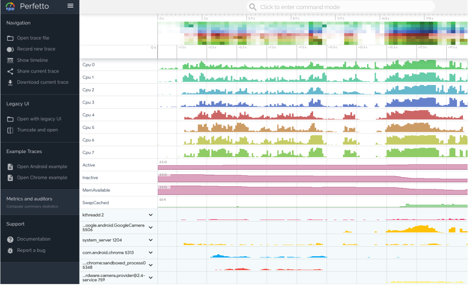
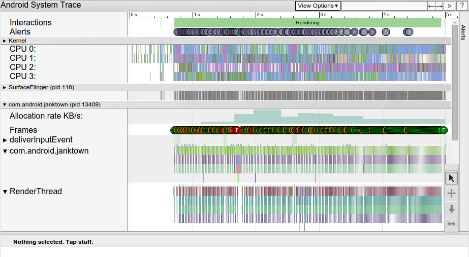
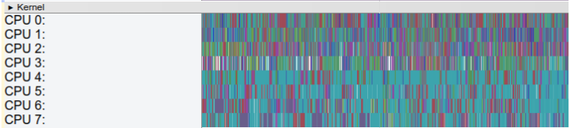
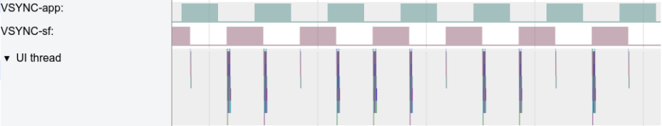
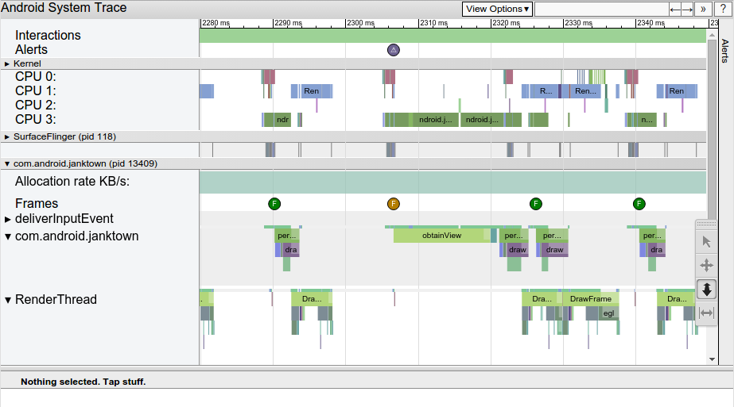
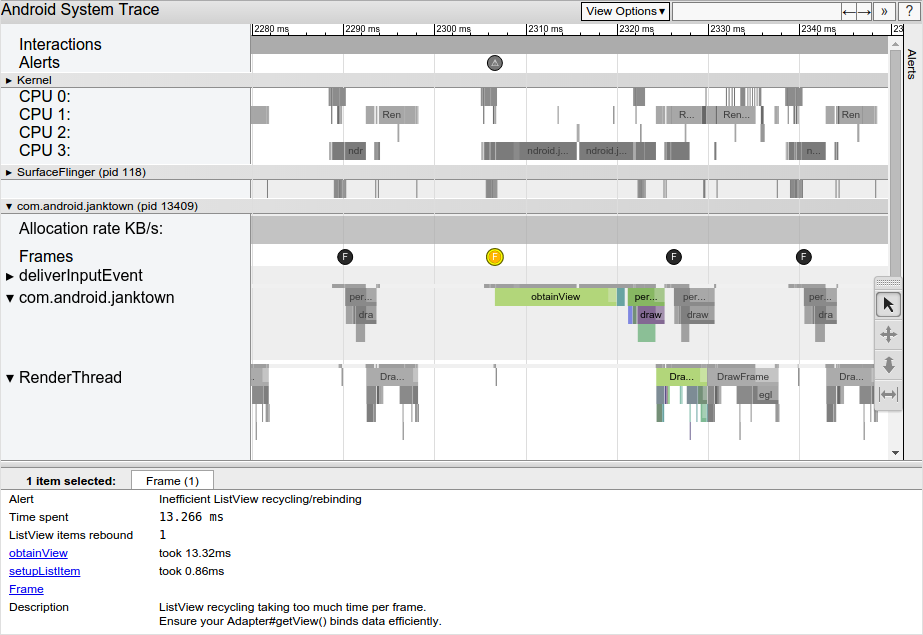
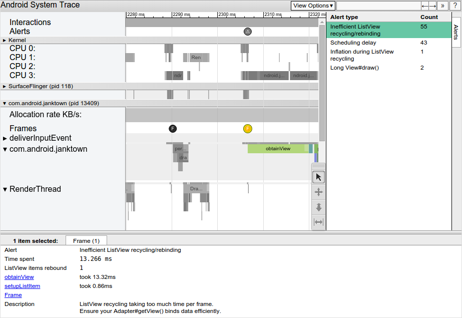

## Android 系统跟踪

### 一、概览

“系统跟踪”就是记录短时间内的设备活动。系统跟踪会生成跟踪文件，该文件可用于生成系统报告。此报告可帮助您了解如何最有效地提升应用或游戏的性能。

Android 平台提供了多种不同的跟踪信息获取途径：

- Android Studio CPU 性能分析器（Profiler）
- 系统跟踪实用程序（手机内置应用）
- Perfetto 命令行工具（Android 10 及更高版本）
- Systrace 命令行工具

Perfetto 是 Android 10 中引入的平台级跟踪工具。这是适用于 Android、Linux 和 Chrome 的成熟开源跟踪项目。与 Systrace 不同，它提供数据源超集，可让您以协议缓冲区二进制流形式记录任意长度的跟踪记录。您可以在 [Perfetto 界面](https://ui.perfetto.dev/#!/) 中打开这些跟踪记录。



Systrace 是平台提供的旧版命令行工具，可记录短时间内的设备活动，并保存在压缩的文本文件中。该工具会生成一份报告，其中汇总了 Android 内核中的数据，例如 CPU 调度程序、磁盘活动和应用线程。Systrace 适用于 Android 4.3（API 级别 18）及更高版本的所有平台版本，但建议将 Perfetto 用于运行 Android 10 及更高版本的设备。



这两份报告都提供了 Android 设备在给定时间段内的系统进程的总体情况。该报告还检查了捕获到的跟踪信息，以突出显示发现的问题（例如界面卡顿或耗电量高）。

Perfetto 和 Systrace 可交互使用：

- 在 Perfetto 界面中打开 Perfetto 文件和 Systrace 文件。在 Perfetto 界面中使用旧版 Systrace 查看器打开 Systrace 文件（使用 **Open with legacy UI** 链接）。
- 使用 `traceconv` 工具[将 Perfetto 跟踪记录转换为旧版 Systrace 文本格式](https://docs.perfetto.dev/#/traceconv.md)

### 二、工具介绍

#### 1. 系统跟踪（System Tracing）

搭载 Android 9（API 级别 28）或更高版本的设备包含一个名为 System Tracing 的系统级应用。此应用类似于 [`systrace`](https://developer.android.com/topic/performance/tracing/command-line?hl=zh-cn) 命令行实用程序，但允许您直接从测试设备本身录制跟踪记录，而无需插入设备并通过 ADB 连接到该设备。

在解决应用中与性能相关的 bug（例如启动速度慢、转换速度慢或界面卡顿）时，录制跟踪记录特别有用。

##### 录制系统跟踪记录

借助 System Tracing 应用，您可以使用“快捷设置”图块或应用自身内的菜单来录制系统跟踪记录。

##### 共享系统跟踪记录

System Tracing 应用可帮助您在多个不同工作流中共享系统跟踪结果。在搭载 Android 10（API 级别 29）或更高版本的设备上，跟踪文件会使用 `.perfetto-trace` 文件扩展名保存，并可在 [Perfetto 界面](https://ui.perfetto.dev/#!/)中打开。在搭载较旧 Android 版本的设备上，跟踪文件会使用 `.ctrace` 文件扩展名（表示 Systrace 格式）保存。

使用 adb 命令提取跟踪记录

```bash
 adb pull /data/local/traces/.
```

##### 创建 HTML 报告

共享跟踪记录时，报告本身位于 `.perfetto-trace` 文件中（在搭载 Android 10 或更高版本的设备上）或 `.ctrace` 文件（其他所有版本）中。

使用[基于网络的界面](https://developer.android.com/topic/performance/tracing/on-device?hl=zh-cn#web-ui)或[命令行](https://developer.android.com/topic/performance/tracing/on-device?hl=zh-cn#command-line)利用跟踪文件创建 HTML 报告。

使用的命令行如下

```bash
 systrace --from-file trace-file-name{.ctrace | .perfetto-trace}
```

#### 2. Systrace

`systrace` 命令会调用 [Systrace 工具](https://developer.android.com/topic/performance/tracing?hl=zh-cn)，可以借助该工具收集和检查设备上在系统一级运行的所有进程的时间信息。

`systrace` 命令在 Android SDK 工具软件包中提供，并且可以在 `android-sdk/platform-tools/systrace/` 中找到。

##### 语法

如需为应用生成 HTML 报告，需要使用以下语法通过命令行运行 `systrace`：

```bash
 python systrace.py [options] [categories]
```

例如，以下命令会调用 `systrace` 来记录设备活动，并生成一个名为 `mynewtrace.html` 的 HTML 报告。此类别列表是大多数设备的合理默认列表。

```bash
 python systrace.py -o mynewtrace.html sched freq idle am wm gfx view \
    binder_driver hal dalvik camera input res memory
```

如需查看已连接设备支持的类别列表，请运行以下命令：

```bash
 python systrace.py --list-categories
```

#### 3. Perfetto

使用 `perfetto` 工具，可以通过 adb 命令在设备上收集性能信息。`perfetto` 从设备上收集性能跟踪数据时会使用多种来源，例如：

- 使用 `ftrace` 收集内核信息
- 使用 `atrace` 收集服务和应用中的用户空间注释
- 使用 `heapprofd` 收集服务和应用的本地内存使用情况信息

##### 语法

###### 数据源选择

`perfetto` 包含以下两种模式，可确定用于记录跟踪数据的数据源：

- **轻量模式**：只能选择一部分数据源，具体来说就是 `atrace` 和 `ftrace`。但此模式可提供类似于 [`systrace`](https://developer.android.com/topic/performance/tracing/command-line?hl=zh-cn) 的接口。
- **普通模式**：从协议缓冲区获取其配置，并允许您更充分地利用 `perfetto` 功能，方法是使用 `atrace` 和 `ftrace` 之外的数据源。

轻量模式

```bash
 adb shell perfetto [ --time TIMESPEC ] [ --buffer SIZE ] [ --size SIZE ]
             [ ATRACE_CAT | FTRACE_GROUP/FTRACE_NAME | FTRACE_GROUP/* ]...
             --out FILE
```

普通模式

```bash
 adb shell perfetto [ --txt ] --config CONFIG_FILE --out FILE
```

具体参数配置参考官方文档：[perfetto](https://developer.android.com/studio/command-line/perfetto?hl=zh-cn)

### 三、数据分析

#### 1. Systrace 数据

Systrace 会生成包含多个部分的输出 HTML 文件。该报告列出了每个进程的线程。如果给定线程会渲染界面帧，该报告还会沿时间轴指明所渲染的帧。当您在报告中从左向右移动时，时间会向前推移。

##### 报告介绍

报告从上到下包含以下几个部分：

###### 用户互动

第一部分包含表示应用或游戏中的具体用户互动（例如点按设备屏幕）的条形图。这些互动可用作有用的时间标记。

###### CPU 活动

下一部分显示了表示每个 CPU 中的线程活动的条形图。这些条形会显示所有应用（包括您的应用或游戏）中的 CPU 活动。

CPU 活动部分可以展开，展开后您就可以查看每个 CPU 的时钟频率。图 1 展示了一个收起后的 CPU 活动部分示例，图 2 展示了显示时钟频率的展开后版本：




###### 系统事件

此部分中的直方图会显示特定的系统级事件，例如特定对象的纹理计数和总大小。

值得仔细检查的直方图是标记为 **SurfaceView** 的直方图。计数表示已传递到显示管道并等待显示在设备屏幕上的组合帧缓冲区的数量。由于大多数设备都会进行双重或三重缓冲，因此该计数几乎总为 0、1 或 2。

描绘 Surface Flinger 进程（包括 VSync 事件和界面线程交换工作）的其他直方图，如图 3 所示：



###### 显示帧

这一部分通常是报告中最顶部的部分，描绘了一条多色线条，后面是成堆的条形。这些形状表示已创建的特定线程的状态和帧堆栈。堆栈的每个层级代表对 `beginSection()` 的一次调用，或为应用定义的[自定义跟踪事件](https://developer.android.com/topic/performance/tracing/custom-events?hl=zh-cn)的开头。

每个条形堆上方的多色线条表示特定线程随时间变化的一组状态。每段线条可以包含以下一种颜色：

- 绿色：正在运行

  线程正在完成与某个进程相关的工作或正在响应中断。

- 蓝色：可运行

  线程可以运行但目前未进行调度。

- 白色：休眠

  线程没有可执行的任务，可能是因为线程在遇到互斥锁定时被阻止。

- 橙色：不可中断的休眠

  线程在遇到 I/O 操作时被阻止或正在等待磁盘操作完成。

- 紫色：可中断的休眠

  线程在遇到另一项内核操作（通常是内存管理）时被阻止。

##### 问题分析

###### 识别性能问题

浏览 Systrace 报告时，可以通过执行以下一项或多项操作来更轻松地识别性能问题：

- 通过在时间间隔周围绘制一个矩形来选择所需的时间间隔。
- 使用标尺工具标记或高亮显示问题区域。
- 依次点击 **View Options > Highlight VSync**，显示每项屏幕刷新操作。

###### 检查界面帧

如图 4 所示，Systrace 报告列出了渲染界面帧的每个进程，并指明了沿时间轴渲染的每个帧。在 16.6 毫秒内渲染的必须保持每秒 60 帧稳定帧速率的帧以绿色圆圈表示。渲染时间超过 16.6 毫秒的帧以黄色或红色帧圆圈表示。



点击某个帧圆圈可将其高亮显示，并提供有关系统为渲染该帧所做工作的其他信息，包括提醒。此报告还会显示系统在渲染该帧时执行的方法。您可以调查这些方法以确定界面卡顿的可能原因。



选择运行速度慢的帧后，您可能会在报告的底部窗格中看到一条提醒。图 5 中显示的提醒指明帧的主要问题是在 [`ListView`](https://developer.android.com/reference/android/widget/ListView?hl=zh-cn) 回收和重新绑定上花费了太多时间。指向跟踪记录中相关事件的链接可详细说明系统在此期间执行的操作。

如需查看此工具在您的跟踪记录中发现的每条提醒以及设备触发每条提醒的次数，请点击窗口最右侧的 **Alerts** 标签页，如图 6 所示。**Alerts** 面板可帮助您了解跟踪记录中出现的问题以及这些问题导致出现卡顿的频率。您可以将此面板视为要修正的 bug 列表。通常情况下，只需对一个区域进行细微改动或改进即可移除整组提醒。



如果您发现在界面线程上执行的工作太多，请使用以下方法之一来帮助确定哪些方法占用了过多的 CPU 时间：

- 如果您想了解哪些方法可能会导致瓶颈，请在这些方法中添加跟踪标记。如需了解详情，请参阅有关如何[在代码中定义自定义事件](https://developer.android.com/topic/performance/tracing/custom-events?hl=zh-cn)的指南。
- 如果您不确定界面瓶颈的来源，请使用 Android Studio 中提供的 [CPU 分析器](https://developer.android.com/studio/profile/cpu-profiler?hl=zh-cn)。您可以[生成跟踪日志](https://developer.android.com/studio/profile/generate-trace-logs?hl=zh-cn)，然后使用 CPU 分析器导入和检查这些日志。

#### 2. Perfetto

Perfetto 网页界面：[Perfetto](https://ui.perfetto.dev/#!/viewer?local_cache_key)

### 四、自定义事件

系统跟踪仅在系统级别显示进程的相关信息，因此有时很难知道应用或游戏的哪些方法是在给定时间针对系统事件执行的。

Jetpack 提供了一个跟踪 API，可用于为特定的代码段添加标签。然后，设备上捕获的跟踪记录中会报告此信息。[Macrobenchmark](https://developer.android.com/studio/profile/macrobenchmark-intro?hl=zh-cn) 会自动使用自定义跟踪记录点来捕获跟踪记录。

使用 systrace 命令行工具捕获跟踪记录时，必须使用 `-a` 选项；如果不使用此选项，您应用的方法将不会显示在系统跟踪报告中。

如需在代码中创建自定义跟踪事件，请使用 Jetpack 跟踪库中的 Trace 类，如以下代码段所示。

```java

/** 注意：如果您多次调用 beginSection()，调用 endSection() 只会结束最近调用的 beginSection() 方法。
 * 因此，对于嵌套调用（如以下代码段中所示），请务必将每次对 beginSection() 的调用与对 endSection() 的调用正确匹配。
 * 此外，您不能在一个线程上调用 beginSection()，而在另一个线程上结束它；您必须在同一个线程上调用这两个方法。
 **/

public class MyAdapter extends RecyclerView.Adapter<MyViewHolder> {
    @Override
    public MyViewHolder onCreateViewHolder(ViewGroup parent, int viewType) {
        Trace.beginSection("MyAdapter.onCreateViewHolder");
        MyViewHolder myViewHolder;
        try {
            myViewHolder = MyViewHolder.newInstance(parent);
        } finally {
            // In try and catch statements, always call "endSection()" in a
            // "finally" block. That way, the method is invoked even when an
            // exception occurs.
            Trace.endSection();
        }
        return myViewHolder;
    }

   @Override
    public void onBindViewHolder(MyViewHolder holder, int position) {
        Trace.beginSection("MyAdapter.onBindViewHolder");
        try {
            try {
                Trace.beginSection("MyAdapter.queryDatabase");
                RowItem rowItem = queryDatabase(position);
                dataset.add(rowItem);
            } finally {
                Trace.endSection();
            }
            holder.bind(dataset.get(position));
        } finally {
            Trace.endSection();
        }
    }
}
```

