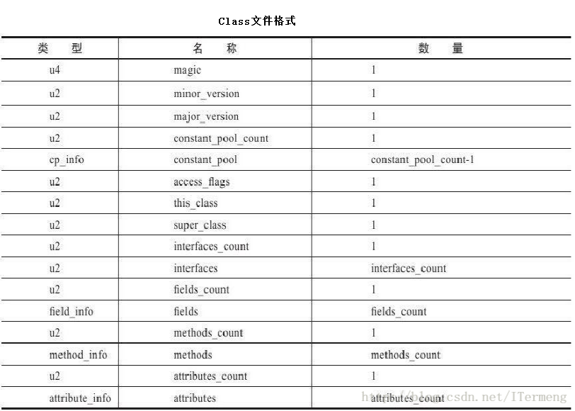
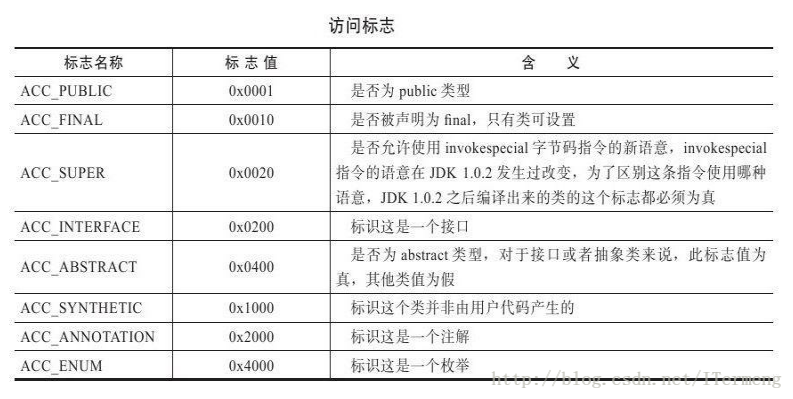
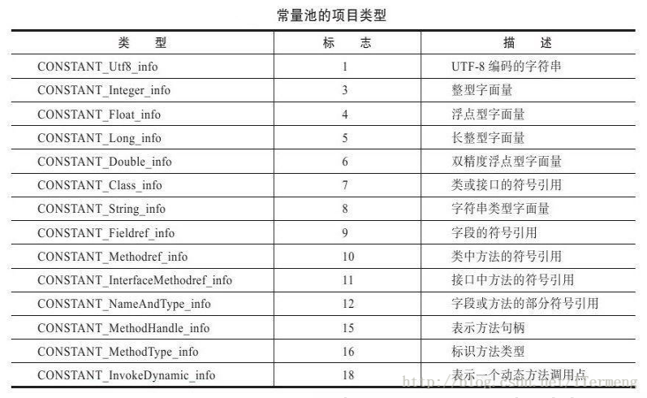

### Class 文件

生成 class 文件

```bash
javac Test.java
```

查看 class 文件

```bash
javap -v Test
```

class 文件具体内容如下：

```bash
Classfile /Users/zyt/MyProjects/nowcoder/src/Test.class
  Last modified Apr 15, 2020; size 545 bytes
  MD5 checksum c7ff35d13da1a565f2fffe48938353ee
  Compiled from "Test.java"
public class Test
  minor version: 0
  major version: 52
  flags: ACC_PUBLIC, ACC_SUPER
Constant pool:
   #1 = Methodref          #8.#19         // java/lang/Object."<init>":()V
   #2 = Fieldref           #20.#21        // java/lang/System.out:Ljava/io/PrintStream;
   #3 = Class              #22            // Offer32
   #4 = Methodref          #3.#19         // Offer32."<init>":()V
   #5 = Methodref          #3.#23         // Offer32.PrintMinNumber:([I)Ljava/lang/String;
   #6 = Methodref          #24.#25        // java/io/PrintStream.println:(Ljava/lang/String;)V
   #7 = Class              #26            // Test
   #8 = Class              #27            // java/lang/Object
   #9 = Utf8               <init>
  #10 = Utf8               ()V
  #11 = Utf8               Code
  #12 = Utf8               LineNumberTable
  #13 = Utf8               main
  #14 = Utf8               ([Ljava/lang/String;)V
  #15 = Utf8               Exceptions
  #16 = Class              #28            // java/io/IOException
  #17 = Utf8               SourceFile
  #18 = Utf8               Test.java
  #19 = NameAndType        #9:#10         // "<init>":()V
  #20 = Class              #29            // java/lang/System
  #21 = NameAndType        #30:#31        // out:Ljava/io/PrintStream;
  #22 = Utf8               Offer32
  #23 = NameAndType        #32:#33        // PrintMinNumber:([I)Ljava/lang/String;
  #24 = Class              #34            // java/io/PrintStream
  #25 = NameAndType        #35:#36        // println:(Ljava/lang/String;)V
  #26 = Utf8               Test
  #27 = Utf8               java/lang/Object
  #28 = Utf8               java/io/IOException
  #29 = Utf8               java/lang/System
  #30 = Utf8               out
  #31 = Utf8               Ljava/io/PrintStream;
  #32 = Utf8               PrintMinNumber
  #33 = Utf8               ([I)Ljava/lang/String;
  #34 = Utf8               java/io/PrintStream
  #35 = Utf8               println
  #36 = Utf8               (Ljava/lang/String;)V
{
  public Test();
    descriptor: ()V
    flags: ACC_PUBLIC
    Code:
      stack=1, locals=1, args_size=1
         0: aload_0
         1: invokespecial #1                  // Method java/lang/Object."<init>":()V
         4: return
      LineNumberTable:
        line 6: 0

  public static void main(java.lang.String[]) throws java.io.IOException;
    descriptor: ([Ljava/lang/String;)V
    flags: ACC_PUBLIC, ACC_STATIC
    Code:
      stack=6, locals=1, args_size=1
         0: getstatic     #2                  // Field java/lang/System.out:Ljava/io/PrintStream;
         3: new           #3                  // class Offer32
         6: dup
         7: invokespecial #4                  // Method Offer32."<init>":()V
        10: iconst_5
        11: newarray       int
        13: dup
        14: iconst_0
        15: iconst_3
        16: iastore
        17: dup
        18: iconst_1
        19: iconst_5
        20: iastore
        21: dup
        22: iconst_2
        23: iconst_1
        24: iastore
        25: dup
        26: iconst_3
        27: iconst_4
        28: iastore
        29: dup
        30: iconst_4
        31: iconst_2
        32: iastore
        33: invokevirtual #5                  // Method Offer32.PrintMinNumber:([I)Ljava/lang/String;
        36: invokevirtual #6                  // Method java/io/PrintStream.println:(Ljava/lang/String;)V
        39: return
      LineNumberTable:
        line 8: 0
        line 9: 39
    Exceptions:
      throws java.io.IOException
}
SourceFile: "Test.java"
```

### class 文件解析

#### 文件特点

- class文件是一种8位字节的二进制流文件；（与大部分文件相同，例如音视频文件）
- 各个数据按顺序紧密排列，无间隙，减少文件体积，加载时更加迅速；（有的文件为了便于方便读取，使其固定字节位一行进行排列，会做一些填充）
- 每个类或借口都单独占据一个class文件，有便于类或借口可独自管理各自的内容，无须交叉；

#### 内部结构及具体字段作用



- magic：无符号4字节类型，是一个加密段，类似md5，用来判断class文件是否被篡改过；
- minor_version： class文件可被加载的最小适配JDK版本；
- major_version：该class文件生成时的JDK版本；
- constant_pool_count： 记录class文件中常量池的数量；
- constant_pool：常量池，总体数量为constant_pool_count-1 注意它的类型是cp_info，即结构体类型，其内部还包含其他类型，是class文件中的重点部分;
- access_flags： class文件的作用域标志，例如public、public final类型等；
- this_class： 文章前面曾提出过问题，为何Java源码中未定义this关键字，却可以直接使用，就是因为JVM在生成class文件时，补充了此字段；
- super_class： 与上同理，JVM会默认填充此类的父类；
- interfaces_count： 记录当前类继承接口的数量，注意只统计当前类显示继承的接口，例如其父类继承的接口数不作统计；
- interfaces： 接口，数量为interfaces_count；
- fields_count： 记录类中所有变量数量；
- fields： 变量，数量为interfaces_count，注意它的类型是field_info，即结构体类型，记录了每个变量名称、所在类、类型等；
- methods_count： 记录类中所有方法数量；
- methods：变量，数量为methods_count，注意它的类型是method_info，即结构体类型，记录了每个方法的名称、所在类、类型等；
- attribute_count：记录类的相关属性数量，以上不曾包含的信息会放置此类型中，例如类上面的注解；
- attributes：属性，属性为attribute_count，注意它的类型是attribute_info，即结构体类型；

#### 重点字段详解

##### access_flags

access_flags访问标志主要用于识别一些类或者接口层次的访问信息，主要包括：

- 是否定义为public类型；
- 是否定义abstract类型；
- 这个Class是类还是接口；
  - 如果是类的话是否被声明为final；

如下所示，访问标志中一共有16个标志位可以使用，当前只制定了8个。



##### constant_pool



以上是常量池中的几种不同类型，需要注意的是这些类型可以大致分成两种：有的类型单纯存储值，而有的类型中存储的只是索引！

例如CONSTANT_Integer_info 、CONSTANT_Long_info、CONSTANT_String_info分别存储class文件中的Integer、Long、String类型值，而CONSTANT_Class_info、CONSTANT_Fieldref_info、CONSTANT_Methodref_info 这三个字段比较复杂，分别记录了类、类中变量、类中方法相关信息，它们存储的并不是真正内容，而是一些索引，最终指向的还是像CONSTANT_Integer_info这种单纯存储数据的值！因此，class文件的所有内容其实就是存储在常量池中CONSTANT_Integer_info等类型中的值。

#### class 文件弊端

以上介绍了class文件中的数据规范分明，但它对于移动设备而言还是有以下弊端：

- class文件中包含各种数据如常量池、field等，而一个应用中有成百乃至更多的类，使用字节码文件存储类信息，内存占用过大，不适合移动端；
- class文件是堆栈的加栈模式，加载速度慢；
- 文件IO操作多，类查找慢；因为每个class文件中只存储了一个Java源文件信息。

https://blog.csdn.net/ITermeng/article/details/79218060