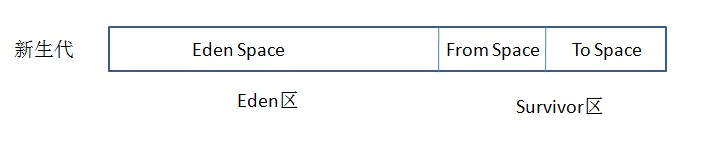
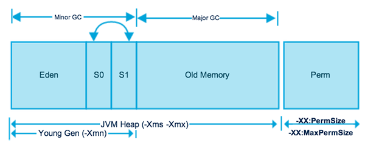

### JVM

- 程序计数器

  程序计数器，保存的是程序当前执行的指令的地址，类似于汇编语言中的 PC 寄存器。

  虽然JVM中的程序计数器并不像汇编语言中的程序计数器一样是物理概念上的CPU寄存器，但是JVM中的程序计数器的功能跟汇编语言中的程序计数器的功能在逻辑上是等同的。

  程序计数器是每个线程私有的。

- Java 栈

  Java栈中存放的是一个个的栈帧，每个栈帧对应一个被调用的方法。

- 本地方法栈

  与 Java 栈类似。区别在于本地方法栈是执行 native 方法的。

- 堆

  存储对象。线程共享。

- 方法区

  存储每个类的信息。还有一个重要区域是运行时常量池。

### 垃圾回收机制

1. 垃圾检测

   - 引用计数法

     通过引用计数来判断一个对象是否可以被回收。优点：实现简单，效率较高；缺点：无法解决循环引用的问题

     Java 不用，Python 用

   - 可达性分析法

     通过一系列“GC Roots”对象作为起点进行搜索。如果在“GC Roots”和一个对象之间没有可达路径，则称该对象是不可达的。

     可作为 GC Roots 的对象：

     - 虚拟机栈（栈帧中本地变量表）中引用的对象
     - 方法区中静态属性引用的对象
     - 方法区中常量引用的对象
     - 本地方法栈中Native方法引用的对象

2. 垃圾回收

   - Mark-Sweep（标记-清除）算法

     标记阶段，标记出所有需要被回收的对象；清除阶段，回收被标记的对象所占用的空间。

     此算法实现起来比较容易，但是容易产生内存碎片。

   - Copying（复制）算法

     将内存按容量划分为大小相等的两块，每次只使用其中的一块。当这一块内存用完了，将存活的对象复制到另一块上面，然后把此块内存清空。

     此算法实现也比较简单，运行高效且不容易产生内存碎片。但内存使用率降低，能够使用的内存缩减到原来的一半。

   - Mark-Compact（标记-整理）算法

     标记阶段，和 Mark-Sweep 算法一样。完成标记后，将存活的对象都向一端移动，然后清理掉端边界以外的内存。

   - Generational Collection（分代收集）算法

     目前大部分 JVM 使用此算法。它的核心思想是根据对象存活的生命周期将内存划分为若干个不同区域。一般情况下分为老年代（Tenured Generation）和新生代（Young Generation）。根据不同代的特点选择最合适的回收算法。

     老年代：

     每次垃圾回收只有少量对象需要被回收。一般使用 Mark-Compact 算法。

     新生代：

     每次垃圾回收都有大量对象需要被回收。一般使用 Copying 算法。但不是根据 1：1 来划分新生代内存空间的。

     一般分为一块较大的 Eden 空间和两块较小的 Survivor 空间，每次使用 Eden 空间和其中一块 Survivor 空间，当进行回收时，将这两块上还存活的对象复制到另一块 Survivor 空间上，然后清理掉这两块空间。

     

     对象主要分配在新生代的Eden Space和From Space，少数情况下会直接分配在老年代。如果新生代的 Eden Space和From Space的空间不足，则会发起一次GC，如果进行了GC之后，Eden Space和From Space能够容纳该对象就放在Eden Space和From Space。在GC的过程中，会将Eden Space和From Space中的存活对象移动到To Space，然后将Eden Space和From Space进行清理。如果在清理的过程中，To Space无法足够来存储某个对象，就会将该对象移动到老年代中。在进行了GC之后，使用的便是Eden space和To Space了，下次GC时会将存活对象复制到From Space，如此反复循环。当对象在Survivor区躲过一次GC的话，其对象年龄便会加1，默认情况下，如果对象年龄达到15岁，就会移动到老年代中。

     

     Java堆的内存划分如图所示，分别为年轻代、Old Memory（老年代）、Perm（永久代）。其中在Jdk1.8中，永久代被移除，使用MetaSpace代替。

     1、新生代：
     （1）使用复制清除算法（Copinng算法），原因是年轻代每次GC都要回收大部分对象。新生代里面分成一份较大的Eden空间和两份较小的Survivor空间。每次只使用Eden和其中一块Survivor空间，然后垃圾回收的时候，把存活对象放到未使用的Survivor（划分出from、to）空间中，清空Eden和刚才使用过的Survivor空间。
     （2）分为Eden、Survivor From、Survivor To，比例默认为8：1：1
     （3）内存不足时发生Minor GC

     2、老年代：
     （1）采用标记-整理算法（mark-compact），原因是老年代每次GC只会回收少部分对象。
     3、Perm：用来存储类的元数据，也就是方法区。
     （1）Perm的废除：在jdk1.8中，Perm被替换成MetaSpace，MetaSpace存放在本地内存中。原因是永久代进场内存不够用，或者发生内存泄漏。
     （2）MetaSpace（元空间）：元空间的本质和永久代类似，都是对JVM规范中方法区的实现。不过元空间与永久代之间最大的区别在于：元空间并不在虚拟机中，而是使用本地内存。

3. 典型的垃圾回收器

   - Serial/Serial Old

   - ParNew

   - Parallel Scavenge

   - CMS

   - G1

     G1 是当今收集器技术发展最前沿的成果