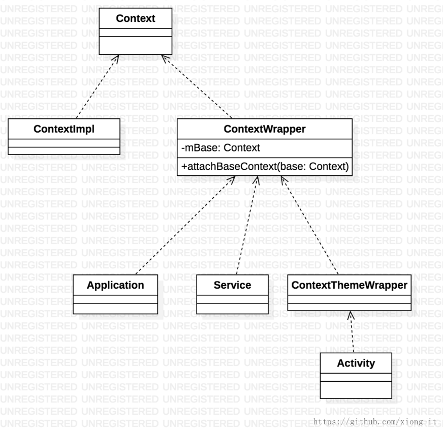

## 设计模式

### 单例模式

单例模式（Singleton Pattern）是 Java 中最简单的设计模式之一。这种类型的设计模式属于创建型模式，它提供了一种创建对象的最佳方式。这种模式涉及到一个单一的类，该类负责创建自己的对象，并且确保只有一个对象被创建。

优点：在内存里只有一个实例，减少了内存的开销，尤其是频繁的创建和销毁实例。

缺点：没有接口，不能继承，与单一职责原则冲突。

#### 单例模式的几种实现方式

1. 懒汉式，线程不安全

   ```java
   public class Singleton {
       private static Singleton instance;
   
       private Singleton() {
       }
   
       public static Singleton getInstance() {
           if (instance == null) {
               instance = new Singleton();
           }
           return instance;
       }
   }
   
   ```

   这种方式是最基本的实现方式，所谓懒汉式，即延迟加载，在需要时才创建对象，避免内存浪费。其中最大的问题就是线程不安全，在多线程时有可能创建多个实例。

2. 懒汉式，线程安全

   ```java
   public class Singleton {
       private static Singleton instance;
   
       private Singleton() {
       }
   
       public static synchronized Singleton getInstance() {
           if (instance == null) {
               instance = new Singleton();
           }
           return instance;
       }
   }
   ```

   这种方式通过添加 synchronized 保证了线程安全，但是效率很低，在多数情况下并不需要加锁。

3. 饿汉式

   ```java
   public class Singleton {
   
       private static final Singleton INSTANCE = new Singleton();
   
       private Singleton() {
       }
   
       public static Singleton getInstance() {
           return INSTANCE;
       }
   }
   ```

   这种方式基于 classloader 机制避免了多线程同步的问题。不过，在类加载时就实例化，不能保证是 getInstance 时导致类装在，所以容易产生垃圾对象。

4. 双重校验锁（DCL，即 double-checked locking）

   ```java
   public class Singleton {
       private volatile static Singleton instance;
   
       private Singleton() {
       }
   
       public static Singleton getInstance() {
           if (instance == null) {
               synchronized (Singleton.class) {
                   if (instance == null) {
                       instance = new Singleton();
                   }
               }
           }
           return instance;
       }
   }
   ```

   这种方式采用双锁机制，安全且在多线程情况下能保持高性能。

   使用 volatile 的原因：

   new 操作不是原子的，实际包含 3 条汇编指令：new,dup,init。当一个线程执行了 new() 时，对应的汇编指令可能发生了重排序，导致第 3 步完成，而第 2 步还没有进行，但是这时仍然会释放锁。一个新的线程到来，发现 instance 已经不为 null 了，直接返回。这时的 instance 是不完整的则会报错。也就是说，会有一个【instance 已经不为 null 但是仍然没有完成初始化】的中间状态。

   使用 volatile 关键字修饰，对它的写操作就会有一个内存屏障，限制了指令重排序。这样，在它的赋值完成之前，就不会有读操作。保证了在一个写操作完成之前，不会调用读操作。

5. 静态内部类

   ```java
   public class Singleton {
   
       private Singleton() {
       }
   
       public static Singleton getInstance() {
           return SingletonHolder.INSTANCE;
       }
   
       private static class SingletonHolder {
           private static final Singleton INSTANCE = new Singleton();
       }
   }
   ```

   这种方式同样利用了 classloader 的机制来保证只有一个 instance 初始化，它跟饿汉式的区别是：饿汉式只要 Singleton 类被加载，instance 就会被实例化，没有达到延迟加载的效果；而这种方式 Singleton 类被加载，instance 不一定被初始化，只有主动调用 getInstance 时，才会加载 SingletonHolder 类，从而实例化 instance。

6. 枚举

   ```java
   public enum Singleton {
       INSTANCE;
   
       public void whateverMethod() {
       }
   }
   ```

   这种方式是 Effective Java 作者 Josh Bloch 提倡的方式，它不仅能避免多线程同步问题，而且还自动支持序列化机制，防止反序列化重新创建新的对象，绝对防止多次实例化。

### 装饰模式

也叫wrapper模式。动态地给一个对象添加一些额外的职责，就增加功能来说，装饰者模式相比生成子类更加灵活，提供了有别于继承的另一种选择。

#### 示例 1

Context是Android中一个几乎无处不在的角色，ContextWrapper/ContextThemeWrapper就在继承过程中承担了ContextImpl的装饰者角色。



#### 示例 2

RecyclerView通过RecyclerView.ItemDecorator来扩展样式。 不过这个是一个变种的装饰者，这个实践比较另类的地方在于：我们通常是在装饰者的的执行方法中扩展被代理对象的行为，而RecyclerView+ItemDecorator的实践则恰恰相反，ItemDecorator反倒成了被代理对象，RecyclerView成了装饰

### 享元模式

享元模式是对象池的一种实现，尽可能减少内存的使用，使用缓存来共享可用的对象，避免创建过多的对象。Android中Message使用的设计模式就是享元模式，获取Message通过obtain方法从对象池获取，Message使用结束通过recycle将Message归还给对象池，达到循环利用对象，避免重复创建的目的。

