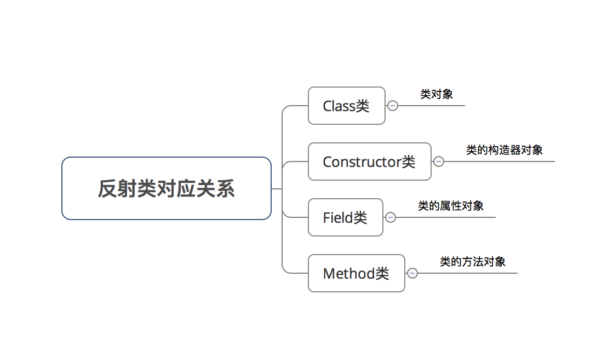

## 反射

#### 简介

Java 的反射机制是指在程序运行时，能够动态的获取类的信息以及动态的调用对象的方法。

优点：灵活性高

缺点：执行效率低、容易破坏类结构

应用场景：动态代理、JDBC 数据库连接等

#### 实现方式

##### Class 类

`java.lang.Class`是反射的基础，JVM会为每个加载到虚拟机的类都维护一个 Class 对象，该对象存放着关于该类的运行时信息。

除了 Class 类，反射还涉及到以下类



#### 使用步骤

在使用Java反射机制时，主要步骤包括：

1. 获取 目标类型的Class对象

   ```java
   // 获取 目标类型的`Class`对象的方式主要有4种
   
   <-- 方式1：Object.getClass() -->
       // Object类中的getClass()返回一个Class类型的实例 
       Boolean carson = true; 
       Class<?> classType = carson.getClass(); 
       System.out.println(classType);
       // 输出结果：class java.lang.Boolean  
   
   <-- 方式2：T.class 语法    -->
       // T = 任意Java类型
       Class<?> classType = Boolean.class; 
       System.out.println(classType);
       // 输出结果：class java.lang.Boolean  
       // 注：Class对象表示的是一个类型，而这个类型未必一定是类
       // 如，int不是类，但int.class是一个Class类型的对象
   
   <-- 方式3：static method Class.forName   -->
       Class<?> classType = Class.forName("java.lang.Boolean"); 
       // 使用时应提供异常处理器
       System.out.println(classType);
       // 输出结果：class java.lang.Boolean  
   
   <-- 方式4：TYPE语法  -->
   
       Class<?> classType = Boolean.TYPE; 
       System.out.println(classType);
       // 输出结果：boolean  
   
   
   ```

2. 通过 Class 对象分别获取Constructor类对象、Method类对象 & Field 类对象

   ```java
   // 即以下方法都属于`Class` 类的方法。
   
   <-- 1. 获取类的构造函数（传入构造函数的参数类型）->>
     // a. 获取指定的构造函数 （公共 / 继承）
     Constructor<T> getConstructor(Class<?>... parameterTypes)
     // b. 获取所有的构造函数（公共 / 继承） 
     Constructor<?>[] getConstructors(); 
     // c. 获取指定的构造函数 （ 不包括继承）
     Constructor<T> getDeclaredConstructor(Class<?>... parameterTypes) 
     // d. 获取所有的构造函数（ 不包括继承）
     Constructor<?>[] getDeclaredConstructors(); 
   // 最终都是获得一个Constructor类对象
   
   // 特别注意：
     // 1. 不带 "Declared"的方法支持取出包括继承、公有（Public） & 不包括有（Private）的构造函数
     // 2. 带 "Declared"的方法是支持取出包括公共（Public）、保护（Protected）、默认（包）访问和私有（Private）的构造方法，但不包括继承的构造函数
     // 下面同理
   
   <--  2. 获取类的属性（传入属性名） -->
     // a. 获取指定的属性（公共 / 继承）
      Field getField(String name) ;
     // b. 获取所有的属性（公共 / 继承）
      Field[] getFields() ;
     // c. 获取指定的所有属性 （不包括继承）
      Field getDeclaredField(String name) ；
     // d. 获取所有的所有属性 （不包括继承）
      Field[] getDeclaredFields() ；
   // 最终都是获得一个Field类对象
   
   <-- 3. 获取类的方法（传入方法名 & 参数类型）-->
     // a. 获取指定的方法（公共 / 继承）
       Method getMethod(String name, Class<?>... parameterTypes) ；
     // b. 获取所有的方法（公共 / 继承）
      Method[] getMethods() ；
     // c. 获取指定的方法 （ 不包括继承）
      Method getDeclaredMethod(String name, Class<?>... parameterTypes) ；
     // d. 获取所有的方法（ 不包括继承）
      Method[] getDeclaredMethods() ；
   // 最终都是获得一个Method类对象
   
   <-- 4. Class类的其他常用方法 -->
   getSuperclass(); 
   // 返回父类
   
   String getName(); 
   // 作用：返回完整的类名（含包名，如java.lang.String ） 
    
   Object newInstance(); 
   // 作用：快速地创建一个类的实例
   // 具体过程：调用默认构造器（若该类无默认构造器，则抛出异常 
   // 注：若需要为构造器提供参数需使用java.lang.reflect.Constructor中的newInstance（）
   
   
   ```

3. 通过 Constructor类对象、Method类对象 & Field类对象分别获取类的构造函数、方法&属性的具体信息，并进行后续操作

   ```java
   // 即以下方法都分别属于`Constructor`类、`Method`类 & `Field`类的方法。
   
   <-- 1. 通过Constructor 类对象获取类构造函数信息 -->
     String getName()；// 获取构造器名
     Class getDeclaringClass()；// 获取一个用于描述类中定义的构造器的Class对象
     int getModifiers()；// 返回整型数值，用不同的位开关描述访问修饰符的使用状况
     Class[] getExceptionTypes()；// 获取描述方法抛出的异常类型的Class对象数组
     Class[] getParameterTypes()；// 获取一个用于描述参数类型的Class对象数组
   
   <-- 2. 通过Field类对象获取类属性信息 -->
     String getName()；// 返回属性的名称
     Class getDeclaringClass()； // 获取属性类型的Class类型对象
     Class getType()；// 获取属性类型的Class类型对象
     int getModifiers()； // 返回整型数值，用不同的位开关描述访问修饰符的使用状况
     Object get(Object obj) ；// 返回指定对象上 此属性的值
     void set(Object obj, Object value) // 设置 指定对象上此属性的值为value
    
   <-- 3. 通过Method 类对象获取类方法信息 -->
     String getName()；// 获取方法名
     Class getDeclaringClass()；// 获取方法的Class对象	
     int getModifiers()；// 返回整型数值，用不同的位开关描述访问修饰符的使用状况
     Class[] getExceptionTypes()；// 获取用于描述方法抛出的异常类型的Class对象数组
     Class[] getParameterTypes()；// 获取一个用于描述参数类型的Class对象数组
   
   <--额外：java.lang.reflect.Modifier类 -->
   // 作用：获取访问修饰符
   
   static String toString(int modifiers)	
   // 获取对应modifiers位设置的修饰符的字符串表示
   
   static boolean isXXX(int modifiers)	
   // 检测方法名中对应的修饰符在modifiers中的值
   
   ```

#### isAccessible()

这个方法不是告诉你属性是否是可访问的，而是说属性的修饰符当前是否应该被忽略的。所以，即使修饰符是public/protected的，返回也可能是 false。

#### setAccessible(boolean)

调用这个方法后，当属性被使用时，Java访问检查开关会禁用/启用。当为 true时，禁用访问检查；当为 false 时，启用访问检查。由于访问检查耗时较多，所以禁用安全检查会提升反射的速度。

#### getFields()

获取所有 public 属性，包括父类。

#### getDeclaredFields()

获取所有属性，不包括父类。