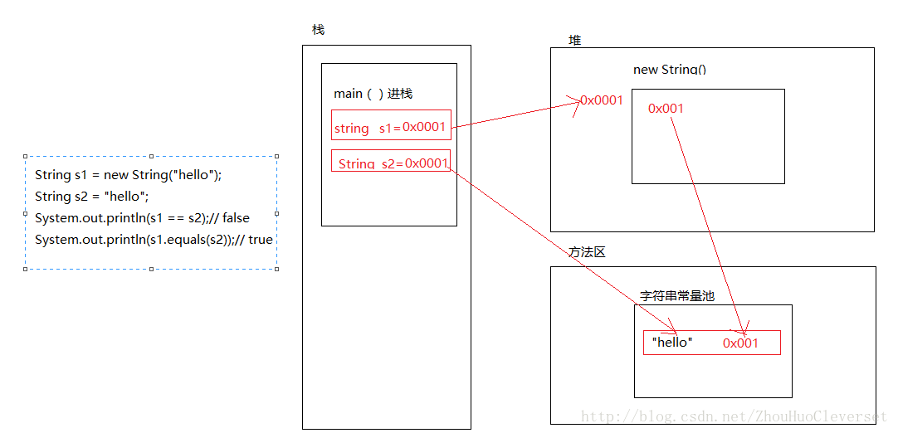

## String

#### 内存分配

1. 首先，通过main（）方法进栈。
2. 然后再栈中定义一个对象s1,去堆中开辟一个内存空间，将内存空间的引用赋值给s1，“hello”是常量，然后去字符串常量池 查看是否有hello字符串对象，没有的话分配一个空间存放hello，并且将其空间地址存入堆中new出来的空间中。
3. 在栈中定义一个对象s2，然后去字符串常量池中查看是否有”hello”字符串对象，有，直接把”hello”的地址赋值给s2.
4. 即s1中存的是堆中分配的空间，堆中分配的空间中存的是字符串常量池中分配空间存放”hello”的空间的地址值。而s2中之间存的是字符串常量池中分配空间存放”hello”的空间的地址值。
5. 由于s1与s2中存放的地址不同，所以输出false。因为，类String重写了equals()方法，它比较的是引用类型的 的值是否相等，所以输出true。即结果为false、true。

#### 字符串 +

- 两个或者两个以上的字符串常量相加，在预编译的时候“+”会被优化，相当于把两个或者两个以上字符串常量自动合成一个字符串常量
- 两个或者两个以上的字符串变量相加，其本质是new了StringBuilder对象进行append操作，拼接后调用toString()返回String对象