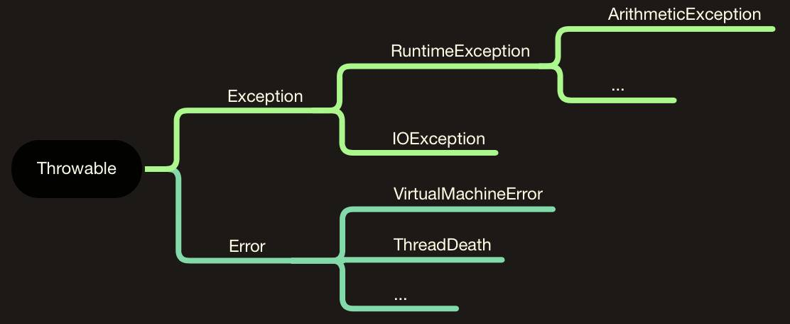

# Java

## Java 集合

- [Java容器类](http://alexyyek.github.io/2015/04/06/Collection/)

### transient 关键字的用法

此关键字与序列化相关。

实现了 Serilizable 接口的类，在属性前添加 transient 关键字，则在序列化对象的时候，这个属性就不会被序列化。

1. 只能修饰属性，不能修饰方法和类，不能修饰局部变量
2. 静态变量无论是否被修饰，均不能被序列化
3. 若实现的是Externalizable接口，则没有任何东西可以自动序列化，需要在writeExternal方法中进行手工指定所要序列化的变量，这与是否被transient修饰无关

[Java transient关键字使用小记](https://www.cnblogs.com/lanxuezaipiao/p/3369962.html)

### volatile 关键字的用法

此关键字与多线程同步相关。

#### 1. 内存模型

- CPU - Cache - Memory
- 缓存不一致问题

#### 2. 并发编程

- 原子性：一个操作或者多个操作，要么全部执行且不会被打断，要么就都不执行
- 可见性：多个线程访问同一个变量时，一个线程修改了变量值，其他线程能够立即看到这个修改的值
- 有序性：程序的执行顺序按照代码的先后顺序执行。JVM 编译时会进行指令重排，程序执行顺序不一定一致但结果一致。指令重排不会影响单个线程的执行，但会影响多线程执行的正确性。

```java
boolean inited = false;

//线程1:
context = loadContext();   //语句1
inited = true;             //语句2
 
//线程2:
while(!inited ){
  sleep()
}
doSomethingwithconfig(context);
```

总结，并发程序正确地执行，必须要保证**原子性、可见性以及有序性**。只要有一个没有被保证，就有可能会导致程序运行不正确。

#### 3. Java 并发编程

- 原子性

  在 Java 中，对基本数据类型的变量的读取和赋值操作是原子性操作（而且必须是将数字赋值给某个变量，变量之间的相互赋值不是原子操作）。要实现更大范围操作的原子性，用 synchronized 和 Lock 来实现。

- 可见性

  在 Java 中，用 volatile 关键字来保证可见性。

  当一个共享变量（属性，静态属性）被volatile修饰时，它会保证修改的值会立即被更新到主存，当有其他线程需要读取时，它会去内存中读取新值。普通的共享变量不能保证可见性，因为什么时候被写入内存是不确定的。

  另外，通过synchronized和Lock也能够保证可见性，synchronized和Lock能保证同一时刻只有一个线程获取锁然后执行同步代码，并且在释放锁之前会将对变量的修改刷新到主存当中。因此可以保证可见性。

- 有序性

  在 Java 中，用 volatile 关键字来保证有序性。另外也可以通过 synchronized 和 Lock 来保证有序性。

#### 4. volatile 关键字

一个共享变量（类的属性、静态属性）被 volatile 修饰之后，那么就具备了两层含义：

1. 保证了可见性
2. 保证了有序性，即禁止了指令重排
3. 不能保证原子性

实现原理：

> 观察加入volatile关键字和没有加入volatile关键字时所生成的汇编代码发现，加入volatile关键字时，会多出一个lock前缀指令

#### 5. 使用场景

synchronized关键字是防止多个线程同时执行一段代码，那么就会很影响程序执行效率，而volatile关键字在某些情况下性能要优于synchronized，但是要注意volatile关键字是无法替代synchronized关键字的

- 状态标记

  ```java
  volatile boolean inited = false;
  
  //线程1:
  context = loadContext();  
  inited = true;            
   
  //线程2:
  while(!inited ){
  sleep()
  }
  doSomethingwithconfig(context);
  ```

- Double-Check

  ```java
  public class Singleton {
  
  		private static volatile Singleton instance = null;
  		
      private Singleton() {
      }
      
      public static Singleton getInstance() {
          if (instance == null) {
              synchronized (Singleton.class) {
                  if (instance == null) {
                      instance = new Singleton();
                  }
              }
          }
          return instance;
      }
  }
  ```

  使用 volatile 的原因：

  new 操作不是原子的，实际包含 3 条汇编指令：new,dup,init。当一个线程执行了 new() 时，对应的汇编指令可能发生了重排序，导致第 3 步完成，而第 2 步还没有进行，但是这时仍然会释放锁。一个新的线程到来，发现 instance 已经不为 null 了，直接返回。这时的 instance 是不完整的则会报错。也就是说，会有一个【instance 已经不为 null 但是仍然没有完成初始化】的中间状态。

  使用 volatile 关键字修饰，对它的写操作就会有一个内存屏障，限制了指令重排序。这样，在它的赋值完成之前，就不会有读操作。保证了在一个写操作完成之前，不会调用读操作。

[Java并发编程：volatile关键字解析](https://www.cnblogs.com/dolphin0520/p/3920373.html)

### Object 类

- getClass()

- hashCode()

- equals(Object)
  重写了equals 方法，必须重写 hashCode 方法（若确定没有用到类似 Map 的地方，则不必重写 hashCode，Map诸多方法使用 hashCode 来判断两个对象是否相等）

- clone()
  先判断是否可 clone，再调用 internalClone

- internalClone()
  native 方法

- toString()

- finalize()
  在垃圾回收器清除对象之前调用。在实际应用中，不要依赖 finalize 方法回收任何资源，因为很难知道这个方法什么时候才能调用。

- wait()/wait(long)/wait(long,int)

  导致线程进入等待状态，直到它被其他线程通过notify()/notifyAll或者一段时间后超时唤醒。该方法只能在**同步方法**中调用。如果当前线程不是锁的持有者，该方法抛出一个IllegalMonitorStateException异常。

  wait()方法是一个本地方法，其底层是通过一个叫做监视器锁的对象来完成的。

  调用 wait()方法后，线程会释放锁。

  一个通过 wait()方法阻塞的线程，必须满足被唤醒后（超时唤醒或者 notify/notifyAll）再次竞争到锁才会继续执行。

- notify()

  **随机选择一个**在该对象上调用wait方法的线程，解除其阻塞状态。该方法只能在**同步方法**或**同步块**内部调用。如果当前线程不是锁的持有者，该方法抛出一个IllegalMonitorStateException异常。

- notifyAll()

  解除**所有**那些在该对象上调用wait方法的线程的阻塞状态。该方法只能在**同步方法**或**同步块**内部调用。如果当前线程不是锁的持有者，该方法抛出一个IllegalMonitorStateException异常。

[Object.wait()与Object.notify()的用法](https://www.cnblogs.com/xwdreamer/archive/2012/05/12/2496843.html)

### 强引用/软引用/弱引用/虚引用

- 强引用

  正常情况下都是强引用，只要对象有强引用，必定不会被回收，即使 OOM

- 软引用

  用来描述一些有用但不是必须的对象，用 SoftReference 类来表示。对于软引用关联着的对象，只有内存不足的时候 JVM 才会回收该对象。实用场景：网页缓存、图片缓存等。

- 弱引用

  也是用来描述非必须对象，用 WeakReference 类表示。对于弱引用关联着的对象，当 JVM 进行垃圾回收时，无论内存是否充足，都会被回收。

- 虚引用

  虚引用不影响对象的生命周期，用 PhantomReference 类表示。对于虚引用关联着的对象，相当于没有引用与之关联一样，在任何时候都可能被垃圾回收器回收。唯一的用处：能在对象被GC时收到系统通知。

### 重载/重写

### 抽象类与接口

- 语法层面上的区别
  1. 抽象类可以提供方法的实现细节，接口只能存在 public abstract 方法
  2. 抽象类成员变量可以是各种类型的，接口成员变量只能是 public static final 类型的
  3. 抽象类能含有静态代码块及静态方法，接口不能有
  4. 一个类只能继承一个抽象类，一个类可以实现多个接口
- 设计层面上的区别
  1. 抽象类是对一种事物的抽象，接口是对行为的抽象
  2. 抽象类作为很多子类的父类，是一种模板式设计；接口是一种行为规范，是一种辐射式设计
  

##### Java 8 中接口的变化

- 新增静态方法

  静态方法使用 static 关键字声明，实现类不能覆盖静态方法。

- 新增默认方法

  默认方法使用 default 关键字声明，实现类可以选择不实现这个方法。

### 内部类

内部类四种形式：成员内部类、局部内部类、匿名内部类、静态内部类

1. 为什么成员内部类可以无条件访问外部类的成员？

   通过反编译，查看字节码文件可以看出，编译器会默认为成员内部类添加一个指向外部类对象的引用 **this$0**，还会在无参的构造器上添加一个参数，传入外部类的引用，所以没有创建外部类对象，也就无法创建成员内部类对象了。

2. 为什么局部内部类和匿名内部类只能访问局部 final 变量和形参

   为了保证变量**生命周期**的一致性，Java 采用了复制的手段来解决这个问题。对于局部变量，如果这个变量的值可以在编译期间确定，则编译器会在内部类的常量池中添加一个相等的值或者直接嵌入到字节码中；对于形参，编译器会在内部类的构造器中加入此参数，进行 copy。但又为了保证**数据**一致性，所以必须将变量限制为 final 变量。

3. 静态内部类使用场景

   - 内部类需要脱离外部类对象来创建对象，如各种 builder 设计模式
   - 避免内部类使用过程中出现内存泄漏，如 AsyncTask

### 浅拷贝和深拷贝

- 浅拷贝：在拷贝对象时，对于基本数据类型会复制一份，对于引用的变量只是对引用进行拷贝，不对引用对象拷贝
- 深拷贝：在拷贝对象时，对基本数据类型和引用的对象都会进行拷贝

#### Fail-Fast & Fail-Safe

- Fail-Fast

  Fail-Fast 机制，通俗的讲就是在程序设计时先考虑异常情况，一旦发生异常，直接停止并上报。这种机制在日常的编程中随处可见。Java 的集合类也使用了 fail-fast 机制进行设计，一旦使用不当，就会抛出异常。

  典型的场景，在 foreach 循环里进行元素的 remove/add 操作，就会抛出 CME 异常。

  ```java
  Exception in thread "main" java.util.ConcurrentModificationException
  at java.util.ArrayList$Itr.checkForComodification(ArrayList.java:909)
  at java.util.ArrayList$Itr.next(ArrayList.java:859)
  at com.hollis.ForEach.main(ForEach.java:22)
  ```

  异常原理：

  1. `foreach`语法糖经过反编译以后，可以看出是依赖 while 和 Iterator 来实现的。

  2. 分析上面的调用栈，可以看出是`checkForComodification`发生了异常，此方法是在 iterator.next()中调用的，具体实现如下：

     ```java
     final void checkForComodification() {
         if (modCount != expectedModCount)
             throw new ConcurrentModificationException();
     }
     ```

  3. 该方法中由于 modCount 和 expectedModCound 不相等而抛出了异常。

     modCount是ArrayList中的一个成员变量，它表示该集合实际被修改的次数。

     expectedModCount 是 ArrayList中的一个内部类——Itr中的成员变量，该类实现了 Iterator 接口。

     而 remove()方法只对 modCount 进行了操作。

     ```java
     private void fastRemove(int index) {
         modCount++;
         int numMoved = size - index - 1;
         if (numMoved > 0)
             System.arraycopy(elementData, index+1, elementData, index,
                              numMoved);
         elementData[--size] = null; // clear to let GC do its work
     }
     ```

     这就导致 modCount != expectedModCount 而导致异常。

  Java 里 util 包下的集合类都是 fail-fast 机制的。

- Fail-Safe

  为了避免出发 fail-fast 机制，Java 中提供了一些采用 fail-safe 机制的集合类。

  concurrent 包下的集合类都是 fail-safe 机制的，可以在多线程下并发使用，并发修改，同时也可以在 foreach 中进行 add/remove。

  fail-safe集合的所有对集合的修改都是先拷贝一份副本，然后在副本集合上进行的，并不是直接对原集合进行修改。并且这些修改方法，如add/remove都是通过加锁来控制并发的。这种策略叫做 Copy-On-Write。

  CopyOnWrite容器即写时复制的容器。通俗的理解是当我们往一个容器添加元素的时候，不直接往当前容器添加，而是先将当前容器进行Copy，复制出一个新的容器，然后新的容器里添加元素，添加完元素之后，再将原容器的引用指向新的容器。CopyOnWrite容器是一种读写分离的思想，读和写不同的容器。

  存在两个问题：

  - 创建 copy 需要额外的空间和时间上的开销
  - 不能保证遍历的是最新的内容

#### 静态分派和动态分派

变量的静态类型：引用类型，不会被改变，在编译期可知

变量的动态类型：实例类型，可变化，在运行期可知

- 静态分派

  应用场景：方法重载（Overload），根据参数的静态类型确定执行哪个重载方法

- 动态分派

  应用场景：方法重写（Override），根据变量的动态类型确定执行哪个方法

#### 异常



- 非受检异常

  RuntimeException 及其子类。这类异常由程序员逻辑错误导致，应该人为承担责任。Java编译器不要求强制处理，即可以捕获或抛出，也可以不捕获或抛出。

  举例：RuntimeException,ArithmeticException,NullPointerException,ClassCastException,ArrayIndexsOutOfBoundsException

- 受检异常

  非RuntimeException异常。这类异常是由于外部的一些偶然因素引起的。Java编译器要求强制处理，即必须得到捕获或抛出。

  举例：

  IOException,SQLException,FileNotFoundException