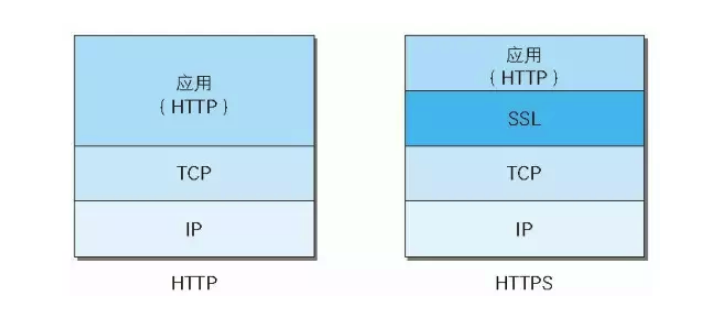
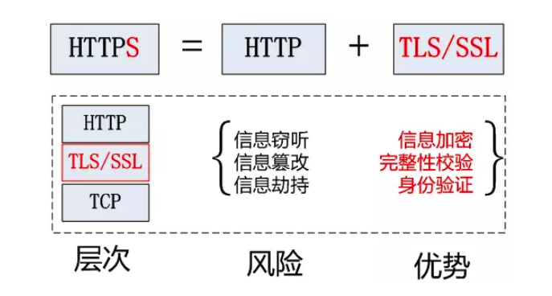
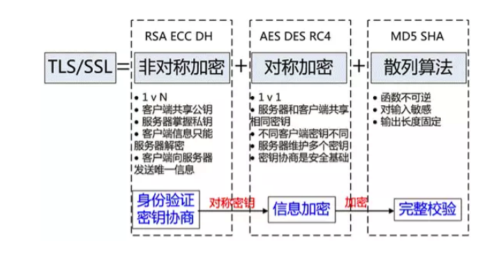

## Https

#### 加密算法

- 对称加密

  对称加密比较简单，就是客户端和服务器共用同一个密钥，该密钥可以用于加密一段内容，同时也可以用于解密这段内容。对称加密的优点是加解密效率高，但是在安全性方面可能存在一些问题，因为密钥存放在客户端有被窃取的风险。对称加密的代表算法有：AES、DES等。

- 非对称加密

  非对称加密则要复杂一点，它将密钥分成了两种：公钥和私钥。公钥通常存放在客户端，私钥通常存放在服务器。使用公钥加密的数据只有用私钥才能解密，反过来使用私钥加密的数据也只有用公钥才能解密。非对称加密的优点是安全性更高，因为客户端发送给服务器的加密信息只有用服务器的私钥才能解密，因此不用担心被别人破解，但缺点是加解密的效率相比于对称加密要差很多。非对称加密的代表算法有：RSA、ElGamal等。

#### Http 缺陷

由于我们在传输数据时信息都是明文的，因此很容易出现数据被监听和窃取的情况。另外，传输的数据还有可能被一些别有用心的人篡改，导致浏览器与网站收发的内容不一致。也就是说，使用http传输数据至少存在着**数据被监听**以及**数据被篡改**这两大风险，因此http是一种不安全的传输协议。

#### Https

HTTPS是在HTTP上建立SSL加密层，并对传输数据进行加密，是HTTP协议的安全版。现在它被广泛用于万维网上安全敏感的通讯，例如交易支付方面。

HTTPS主要作用是：

（1）对数据进行加密，并建立一个信息安全通道，来保证传输过程中的数据安全;

（2）对网站服务器进行真实身份认证。

反观HTTPS协议，它比HTTP协议相比多了以下优势（下文会详细介绍）:

- 数据隐私性：内容经过对称加密，每个连接生成一个唯一的加密密钥
- 数据完整性：内容传输经过完整性校验
- 身份认证：第三方无法伪造服务端（客户端）身份

#### Https 原理

HTTPS并非是应用层的一种新协议。只是HTTP通信接口部分用SSL和TLS协议代替而已。

通常，HTTP直接和TCP通信。当使用SSL时，则演变成先和SSL通信，再由SSL和TCP通信了。简言之，**所谓HTTPS，其实就是身披SSL协议这层外壳的HTTP**。

在采用SSL后，HTTP就拥有了HTTPS的加密、证书和完整性保护这些功能。也就是说**HTTP加上加密处理和认证以及完整性保护后即是HTTPS**。

HTTPS 协议的主要功能基本都依赖于 TLS/SSL 协议，TLS/SSL 的功能实现主要依赖于三类基本算法：散列函数 、对称加密和非对称加密，**其利用非对称加密实现身份认证和密钥协商，对称加密算法采用协商的密钥对数据加密，基于散列函数验证信息的完整性**。

Https 采用对称加密+非对称加密结合的方式进行数据传输，具体做法是：

**发送密文的一方使用对方的公钥进行加密处理“对称的密钥”，然后对方用自己的私钥解密拿到“对称的密钥”，这样可以确保交换的密钥是安全的前提下，使用对称加密方式进行通信**。

1. 既然数据以明文的形式在网络上传输是不安全的，那么我们显然要对数据进行加密才行。刚才提到了，加密方式主要有两种，对称加密和非对称加密。对称加密的优点是加解密效率高，而我们在网络上传输数据是非常讲究效率的，因此这里很明显应该使用**对称加密**。
2. 如果我们想要安全地创建一个对称加密的密钥，可以**让浏览器这边来随机生成**，但是生成出来的密钥不能直接在网络上传输，而是要用网站提供的公钥对其进行非对称加密。由于公钥加密后的数据只能使用私钥来解密，因此这段数据在网络上传输是绝对安全的。而网站在收到消息之后，只需要使用私钥对其解密，就获取到浏览器生成的密钥了。使用这种方式，只有在浏览器和网站首次商定密钥的时候需要使用非对称加密，一旦网站收到了浏览器随机生成的密钥之后，双方就可以都使用对称加密来进行通信了，因此工作效率是非常高的。
3. 浏览器该怎样才能获取到网站的公钥呢？虽然公钥是属于公开的数据，在网络上传输不怕被别人监听，但是如果公钥被别人篡改了怎么办？这个时候，就必须引入一个新的概念来打破僵局了：**CA机构**。CA机构专门用于给各个网站签发数字证书，从而保证浏览器可以安全地获得各个网站的公钥。
4. 首先，我们作为一个网站的管理员需要向CA机构进行申请，将自己的公钥提交给CA机构。CA机构则会使用我们提交的公钥，再加上一系列其他的信息，如网站域名、有效时长等，来制作证书。证书制作完成后，CA机构会使用自己的私钥对其加密，并将加密后的数据返回给我们，我们只需要将获得的加密数据配置到网站服务器上即可。
5. 每当有浏览器请求我们的网站时，首先会将这段加密数据返回给浏览器，此时浏览器会用CA机构的公钥来对这段数据解密。如果能解密成功，就可以得到CA机构给我们网站颁发的证书了，其中当然也包括了我们网站的公钥。而如果无法解密成功，则说明此段加密数据并不是由一个合法的CA机构使用私钥加密而来的，有可能是被篡改了。
6. 有了CA机构之后就真的安全了吗？我们在浏览器端要使用CA机构的公钥来解密数据，那么又该如何安全地获取到CA机构的公钥呢？因为世界上的网站是无限多的，而CA机构总共就那么几家。任何正版操作系统都会将所有主流CA机构的公钥内置到操作系统当中，所以我们不用额外获取，解密时只需遍历系统中所有内置的CA机构的公钥，只要有任何一个公钥能够正常解密出数据，就说明它是合法的。
7. 那么回到一开始的问题：https使用的是对称加密还是非对称加密呢？答案也很明显了，https使用的是对称加密与非对称加密相结合的方式。

#### Http 与 Https

- HTTP 是明文传输协议，HTTPS 协议是由 SSL+HTTP 协议构建的可进行加密传输、身份认证的网络协议，比 HTTP 协议安全。
- HTTPS比HTTP更加安全，对搜索引擎更友好，利于SEO,谷歌、百度优先索引HTTPS网页;
- HTTPS需要用到SSL证书，而HTTP不用;
- HTTPS标准端口443，HTTP标准端口80;
- HTTPS基于传输层，HTTP基于应用层;
- HTTPS在浏览器显示绿色安全锁，HTTP没有显示;

既然HTTPS那么安全可靠，那为何不所有的Web网站都使用HTTPS？

首先，很多人还是会觉得HTTPS实施有门槛，这个门槛在于需要权威CA颁发的SSL证书。从证书的选择、购买到部署，传统的模式下都会比较耗时耗力。

其次，HTTPS普遍认为性能消耗要大于HTTP，因为**与纯文本通信相比，加密通信会消耗更多的CPU及内存资源**。

除此之外，**想要节约购买证书的开销也是原因之一**。

最后是安全意识。相比国内，国外互联网行业的安全意识和技术应用相对成熟，HTTPS部署趋势是由社会、企业、政府共同去推动的。

参考链接：[写一篇最好懂的 https 讲解](https://mp.weixin.qq.com/s/DGIkZT26CBafJzpQgrqqdQ)

[深入理解HTTPS工作原理](https://juejin.im/post/5ca6a109e51d4544e27e3048)